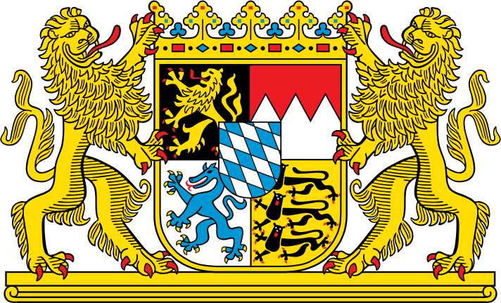
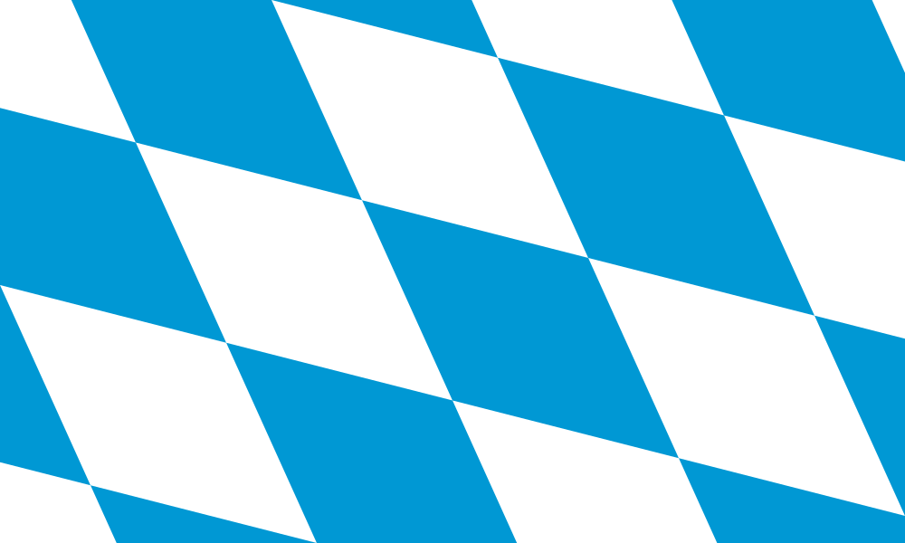

---
has_id_wikidata: Q980
location:
  - 48.8642
  - 11.3382
type: State
ISO3166-2: DE-BY
SpocWebEntityId: 36016
license: CC BY-SA 4.0
source: https://datahub.io/core/country-codes
isDeleted: false
isReadOnly: false
draft: false
confidential: public
tags:
  - geo/State
icon: Flag_of_Bavaria_(lozengy)
language used:
  - "[[_Standards/WikiData/WD~East Franconian German]]"
  - "[[_Standards/WikiData/WD~Swabian]]"
  - "[[_Standards/WikiData/WD~Main-Franconian]]"
  - "[[_Standards/WikiData/WD~Bavarian]]"
  - "[[_Standards/WikiData/WD~German]]"
twinned administrative body:
  - "[[_Standards/WikiData/WD~Western Cape]]"
  - "[[_Standards/WikiData/WD~Gauteng]]"
  - "[[_Standards/WikiData/WD~Karnataka]]"
  - "[[_Standards/WikiData/WD~Georgia]]"
  - "[[_Standards/WikiData/WD~Guangdong]]"
  - "[[_Standards/WikiData/WD~São Paulo]]"
  - "[[_Standards/WikiData/WD~Quebec]]"
  - "[[_Standards/WikiData/WD~Shandong]]"
public holiday:
  - "[[_Standards/WikiData/WD~Epiphany]]"
  - "[[_Standards/WikiData/WD~Feast of Corpus Christi]]"
  - "[[_Standards/WikiData/WD~Reformation Day]]"
  - "[[_Standards/WikiData/WD~Assumption of Mary]]"
  - "[[_Standards/WikiData/WD~Easter Monday]]"
  - "[[_Standards/WikiData/WD~Whit Monday]]"
  - "[[_Standards/WikiData/WD~Second Day of Christmas]]"
  - "[[_Standards/WikiData/WD~All Saints' Day]]"
  - "[[_Standards/WikiData/WD~Christmas]]"
  - "[[_Standards/WikiData/WD~New Year]]"
  - "[[_Standards/WikiData/WD~Good Friday]]"
  - "[[_Standards/WikiData/WD~International Workers' Day]]"
  - "[[_Standards/WikiData/WD~Feast of the Ascension]]"
follows: "[[_Standards/WikiData/WD~Kingdom of Bavaria]]"
named after: "[[_Standards/WikiData/WD~Bajuwari]]"
lowest point: "[[_Standards/WikiData/WD~Kahl am Main]]"
shares border with:
  - "[[_Standards/WikiData/WD~South Bohemian Region]]"
  - "[[_Standards/WikiData/WD~Karlovy Vary Region]]"
  - "[[_Standards/WikiData/WD~Baden-Württemberg]]"
  - "[[_Standards/WikiData/WD~Hesse]]"
  - "[[_Standards/WikiData/WD~Saxony]]"
  - "[[_Standards/WikiData/WD~Thuringia]]"
  - "[[_Standards/WikiData/WD~canton St. Gallen]]"
  - "[[_Standards/WikiData/WD~Vorarlberg]]"
  - "[[_Standards/WikiData/WD~Upper Austria]]"
  - "[[_Standards/WikiData/WD~Tyrol]]"
  - "[[_Standards/WikiData/WD~Salzburg]]"
  - "[[_Standards/WikiData/WD~Plzeň Region]]"
anthem: "[[_Standards/WikiData/WD~Bayernhymne]]"
history of topic: "[[_Standards/WikiData/WD~history of Bavaria]]"
official language:
  - "[[_Standards/WikiData/WD~Standard High German]]"
  - "[[_Standards/WikiData/WD~Bavarian]]"
described by source:
  - "[[_Standards/WikiData/WD~Brockhaus and Efron Encyclopedic Dictionary]]"
  - "[[_Standards/WikiData/WD~Encyclopædia Britannica 11th edition]]"
  - "[[_Standards/WikiData/WD~The Nuttall Encyclopædia]]"
  - "[[_Standards/WikiData/WD~Sytin Military Encyclopedia]]"
  - "[[_Standards/WikiData/WD~Jewish Encyclopedia of Brockhaus and Efron]]"
  - "[[_Standards/WikiData/WD~Granat Encyclopedic Dictionary]]"
  - "[[_Standards/WikiData/WD~Small Brockhaus and Efron Encyclopedic Dictionary]]"
  - "[[_Standards/WikiData/WD~Orthodox Theological Encyclopedia]]"
  - "[[_Standards/WikiData/WD~Vlastenský slovník historický]]"
legislative body:
  - "[[_Standards/WikiData/WD~Landtag of Bavaria]]"
coat of arms: "[[_Standards/WikiData/WD~coat of arms of Bavaria]]"
flag: "[[_Standards/WikiData/WD~flag of Bavaria]]"
executive body:
  - "[[_Standards/WikiData/WD~Government of Bavaria]]"
highest judicial authority: "[[_Standards/WikiData/WD~Bavarian Constitutional Court]]"
archives at: "[[_Standards/WikiData/WD~Bavarian Hauptstaatsarchiv]]"
instance of:
  - "[[_Standards/WikiData/WD~federated state of Germany]]"
basic form of government:
  - "[[_Standards/WikiData/WD~parliamentary republic]]"
topic's main Wikimedia portal: "[[_Standards/WikiData/WD~Portal:Bavaria]]"
office held by head of government: "[[_Standards/WikiData/WD~Minister-President of Bavaria]]"
coordinates of southernmost point: Point(10.17833 47.2701)
top-level Internet domain: "[[_Standards/db/.bayern]]"
"Image Archive, Herder Institute": Q980
open data portal:
  - "[[_Standards/WikiData/WD~open bydata]]"
economy of topic: "[[_Standards/WikiData/WD~economy of Bavaria]]"
different from:
  - "[[_Standards/WikiData/WD~Q108285653]]"
award received: "[[_Standards/WikiData/WD~BigBrotherAwards]]"
U.S. National Archives Identifier: "10044973"
geoshape: http://commons.wikimedia.org/data/main/Data:Bayern.map
page banner: http://commons.wikimedia.org/wiki/Special:FilePath/Bavaria%20banner%20Neuschwanstein%20Castle.jpg
location map: http://commons.wikimedia.org/wiki/Special:FilePath/Bavaria%20location%20map.svg
relief location map: http://commons.wikimedia.org/wiki/Special:FilePath/Bavaria%20relief%20location%20map.jpg
pronunciation audio:
  - http://commons.wikimedia.org/wiki/Special:FilePath/De-Bayern.ogg
  - http://commons.wikimedia.org/wiki/Special:FilePath/Rm-sursilv-Baviera.flac
  - http://commons.wikimedia.org/wiki/Special:FilePath/Hu-Bajororsz%C3%A1g.ogg
  - http://commons.wikimedia.org/wiki/Special:FilePath/LL-Q150%20%28fra%29-Fabricio%20Cardenas%20%28BiblioCanet66%29-Bavi%C3%A8re.wav
locator map image: http://commons.wikimedia.org/wiki/Special:FilePath/Locator%20map%20Bavaria%20in%20Germany.svg
detail map:
  - http://commons.wikimedia.org/wiki/Special:FilePath/Topografische%20Karte%20Bayern.tif
official website: https://www.bayern.de/
IPA transcription: ˈbaɪ̯ɐn
Swedish Anbytarforum: "6076.0"
Provenio UUID: 87968234-ee61-4d94-abe4-9e70ff9da6ae
BHCL UUID:
  - b8111df2-3516-4d30-8087-1895837e1b9a
  - 53e90ed0-ce88-499f-8668-7823f6299b54
ISO 3166-2 code: DE-BY
HASC:
  - DE.BY
NUTS code: DE2
FIPS 10-4 (countries and regions): GM02
short name:
  - Boarn
  - Beieren
  - Beieren
  - Bayern
  - Baviera
  - Bavaria
  - Bavière
official name:
  - Freistoot Boarn
  - Free State of Bavaria
  - Stato Libero di Baviera
  - Freistaat Bayern
  - État libre de Bavière
demonym:
  - Bayerin
  - Bayerinnen
  - баварец
  - баварка
  - bavarese
  - Bayern
  - баварцы
  - Bayer
  - bajor
coordinates of easternmost point: Point(13.83741 48.70057)
Instagram username: bayern.de
Threads username: bayern.de
image: http://commons.wikimedia.org/wiki/Special:FilePath/ISS058-E-13128%20-%20View%20of%20Germany.jpg
ISNI: "0000000123218078"
privacy policy URL: https://www.bayern.de/datenschutz/
impressum URL: https://www.bayern.de/impressum/
terms of service URL: https://www.bayern.de/impressum/
contact page URL: https://www.bayern.de/buergerservice/kontakt/
email address: mailto:direkt@bayern.de
phone number: +49-89-21650
web feed URL:
  - https://www.bayern.de/rss/pm.php
  - https://www.bayern.de/rss/newsletter.php
  - https://www.bayern.de/rss/pm_alle.php
coordinates of westernmost point: Point(8.97627 50.05033)
patron saint: "[[_Standards/WikiData/WD~Virgin Mary]]"
capital: "[[_Standards/WikiData/WD~Munich]]"
highest point: "[[_Standards/WikiData/WD~Zugspitze]]"
contains the administrative territorial entity:
  - "[[_Standards/WikiData/WD~Lower Franconia]]"
  - "[[_Standards/WikiData/WD~Middle Franconia]]"
  - "[[_Standards/WikiData/WD~Upper Franconia]]"
  - "[[_Standards/WikiData/WD~Upper Palatinate]]"
  - "[[_Standards/WikiData/WD~Lower Bavaria]]"
  - "[[_Standards/WikiData/WD~Swabia]]"
  - "[[_Standards/WikiData/WD~Upper Bavaria]]"
located in time zone:
  - "[[_Standards/WikiData/WD~Central European Time]]"
continent: "[[_Standards/WikiData/WD~Europe]]"
located in the administrative territorial entity: "[[_Standards/WikiData/WD~Germany]]"
country: "[[_Standards/WikiData/WD~Germany]]"
water as percent of area: 2
unemployment rate: 3
compulsory education (minimum age): 6
compulsory education (maximum age): 18
social media followers: 24100
part of: "[[_Standards/WikiData/WD~Southern Germany]]"
elevation above sea level: 503
head of government: "[[_Standards/WikiData/WD~Markus Söder]]"
German regional key: "09"
OmegaWiki Defined Meaning: "7138"
area: 70551
coat of arms image: http://commons.wikimedia.org/wiki/Special:FilePath/Coat%20of%20arms%20of%20Bavaria.svg
Dewey Decimal Classification: 2--433
Facebook username: bayern
population: 13124737
small logo or icon: http://commons.wikimedia.org/wiki/Special:FilePath/Flag%20of%20Bavaria%20%28lozengy%29.svg
flag image:
  - http://commons.wikimedia.org/wiki/Special:FilePath/Flag%20of%20Bavaria%20%28lozengy%29.svg
  - http://commons.wikimedia.org/wiki/Special:FilePath/Flag%20of%20Bavaria%20%28striped%29.svg
budget: 71424666800
native label:
  - Freistaat Bayern
inception: 1919-01-12  
has_time_started: 1919-01-12  
coordinate location: Point(11.385555555 49.078611111)
coordinates of northernmost point: Point(10.19564 50.55515)
Commons category: Bavaria
Commons gallery: Bayern
YouTube handle: Bayern
cssclasses:
  - state
publish: true
linkTitle: 
keywords: 
layout: 
publishDate: 
expiryDate: 
aliases:
  - Bavaria
---

# [[Bayern]] 

[name::Bayern] 
[name-abbr::BY] 
#has_/url_for_/code_repository :: https://github.com/SpocWiki/Germany-Bayern 

> [!info]
This Article is only a Stub. 
If you need detailed geographical or historical Information, 
do check out [this 'Bavaria' Sub-Repository](https://github.com/SpocWiki/Germany-Bayern) 
into a sub-folder named `/Bavaria/` next to this File, 
so that this Link into the Sub-Repository works: [[Bavaria/ReadMe]] 

> [!warning] This can considerably increase the total size and depth of your wiki.


## #has_/text_of_/abstract  

> **Bavaria**, officially the Free State of Bavaria, is a state in the southeast of Germany. 
> With an area of 70,550.19 km2 (27,239.58 sq mi), it is the largest German state by land area, 
> comprising roughly a fifth of the total land area of Germany. 
> 
> With over 13 million inhabitants, it is the second most populous German state 
> behind North Rhine-Westphalia, but due to its large physical size 
> its population density is below the German average. 
> 
> Major cities include Munich (its capital and largest city, 
> which is also the third largest city in Germany), Nuremberg, and Augsburg.
>
> The history of Bavaria includes its earliest settlement by Iron Age Celtic tribes, 
> followed by the conquests of the Roman Empire in the 1st century BC, 
> when the territory was incorporated into the provinces of Raetia and Noricum. 
> 
> It became the Duchy of Bavaria (a stem duchy) in the 6th century AD 
> following the collapse of the Western Roman Empire. 
> 
> It was later incorporated into the Holy Roman Empire, 
> became the independent Kingdom of Bavaria after 1806, 
> joined the Prussian-led German Empire in 1871 while retaining its title of kingdom, 
> and finally became a state of the Federal Republic of Germany in 1949. 
> Bavaria has a distinct culture, largely because of its Catholic heritage and conservative traditions, 
> which includes a language, cuisine, architecture, festivals and elements of Alpine symbolism. 
> 
> It also has the second-largest economy among the German states by GDP figures, 
> giving it the status of a wealthy German region. 
> 
> Contemporary Bavaria also includes parts of the historical regions of Franconia and Swabia, 
> in addition to Altbayern.
>
> [Wikipedia](https://en.wikipedia.org/wiki/Bavaria)

## Maps and Flags 

## #has_/image_for_/coat_of_arms 

#has_/image_for_/coat_of_arms :: ![[./Bayern/Coat_of_arms_of_Bavaria.svg|350]]  

## #has_/image_for_/flag 

#has_/image_for_/flag :: ![[./Bayern/Flag_of_Bavaria~lozengy.svg|200]]  

## #has_/map :: [DEU-Germany-1591-Bayern](./Bayern/DEU-Germany-1591-Bayern.geojson) 

```leaflet
id: Bayern
zoomFeatures: true 
minZoom: 2 
maxZoom: 18
geojsonFolder: ./Bayern/
markerFolder: ./Bayern/
```


has_place_country:: [[Germany]]  
Capital ::  [[München]] 
#is_a_/Place  
#is_a_ :: [[Place]] 
[has_place_longitude::11.3382] 
[has_place_latitude::48.8642] 
[Population::] 


## Confidential Links & Embeds: 

### [Bayern](/_public/Earth/Continent/Europe/Europe~Central/Germany/Germany~West/Bayern.md) 

### [Bayern.internal](/_internal/Earth/Continent/Europe/Europe~Central/Germany/Germany~West/Bayern.internal.md) 

### [Bayern.protect](/_protect/Earth/Continent/Europe/Europe~Central/Germany/Germany~West/Bayern.protect.md) 

### [Bayern.private](/_private/Earth/Continent/Europe/Europe~Central/Germany/Germany~West/Bayern.private.md) 

### [Bayern.personal](/_personal/Earth/Continent/Europe/Europe~Central/Germany/Germany~West/Bayern.personal.md) 

### [Bayern.secret](/_secret/Earth/Continent/Europe/Europe~Central/Germany/Germany~West/Bayern.secret.md) 
