---
aliases:
- Berlin_S-Bahn
---

## #has_/text_of_/abstract  

> The Berlin S-Bahn (German: [ˈɛs baːn]) is a rapid transit railway system in and around Berlin, 
> the capital city of Germany. 
> 
> It has been in operation under this name since December 1930, having been previously 
> called the special tariff area Berliner Stadt-, Ring- und Vorortbahnen. 
> 
> It complements the Berlin U-Bahn and is the link to many outer-Berlin areas, 
> such as Berlin Brandenburg Airport. 
> As such, the Berlin S-Bahn blends elements of a commuter rail service and a rapid transit system.
>
> In its first decades of operation, the trains were steam-drawn; 
> even after the electrification of large parts of the network, some lines remained under steam. 
> 
> Today, the term S-Bahn is used in Berlin only for those 
> lines and trains with third-rail electrical power transmission and the special Berlin S-Bahn loading gauge. 
> 
> The third unique technical feature of the Berlin S-Bahn, the automated mechanical train control 
> (works very similar to the train stop at New York City Subway), is being phased out 
> and replaced by a communications-based train control system specific to the Berlin S-Bahn.
>
> In other parts of Germany and other German-speaking countries, 
> other trains are designated S-Bahn without those Berlin-specific features. 
> The [[Hamburg_S-Bahn]] is the only other system using third-rail electrification.
>
> Today, the Berlin S-Bahn is no longer defined as this special tariff area of the national railway company, 
> but is instead just one specific means of transportation, defined by its special technical characteristics, 
> in an area-wide tariff administered by a public transport authority. 
> The Berlin S-Bahn is now an integral part of the Verkehrsverbund Berlin-Brandenburg, 
> the regional tariff zone for all kinds of public transit in and around Berlin 
> and the federal state (Bundesland) of Brandenburg.
>
> [Wikipedia](https://en.wikipedia.org/wiki/Berlin%20S-Bahn)

## #has_/parts 

### [[S-Bahn,Berlin/S1,Berlin]] 

### [[S-Bahn,Berlin/S2,Berlin]] 

S25 and S16 share a large part of S2 

#### [[S25,Berlin]] 

#### [[S26,Berlin]] 

### [[S-Bahn,Berlin/S3,Berlin]] 

### [[S41,Berlin]] 

### [[S42,Berlin]] 

### [[S-Bahn,Berlin/S45,Berlin]] 

### [[S-Bahn,Berlin/S46,Berlin]] 

### [[S-Bahn,Berlin/S47,Berlin]] 

### [[S-Bahn,Berlin/S5,Berlin]] 

### [[S-Bahn,Berlin/S7,Berlin]]

### [[S75,Berlin]]

### [[S-Bahn,Berlin/S8,Berlin]] 

### [[S85,Berlin]] 

### [[S-Bahn,Berlin/S9,Berlin]] 

## #has_/diagram 

```mermaid
graph TD



%% Class Definitions %%
classDef greenText fill:#6ECF68,stroke:#2E7D32,stroke-width:2px,color:#FFF;
classDef redText fill:#E57373,stroke:#C62828,stroke-width:2px,color:#FFF;
classDef blueText fill:#64B5F6,stroke:#1565C0,stroke-width:2px,color:#FFF;
classDef cyanText fill:#6CC,stroke:#2E7D32,stroke-width:2px,color:#FFF;
classDef magentaText fill:#C6C,stroke:#C62828,stroke-width:2px,color:#FFF;
classDef orangeText fill:#FA0,stroke:#1565C0,stroke-width:2px,color:#FFF;
classDef brownText fill:#A33,stroke:#1565C0,stroke-width:2px,color:#FFF;
classDef oliveText fill:#880,stroke:#1565C0,stroke-width:2px,color:#FFF;
classDef yellowText fill:#FF0,stroke:#1565C0,stroke-width:2px,color:#000;
classDef pinkText fill:#FBC,stroke:#1565C0,stroke-width:2px,color:#000;


subgraph S1 ["S1 Line"]
S_Oranienburg("Oranienburg") --> 
S_Lehnitz("Lehnitz") --> 
S_Borgsdorf("Borgsdorf") --> 
S_Birkenwerder("Birkenwerder") --> 
S_Hohen_Neuendorf("Hohen Neuendorf") --> 
S_Frohnau("Frohnau") --> 
S_Hermsdorf("Hermsdorf") --> 
S_Waidmannslust("Waidmannslust") --> 
S_Wittenau("Wittenau") --> 
S_Wilhelmsruh("Wilhelmsruh") --> 
S_Schönholz("Schönholz") --> 
S_Wollankstraße("Wollankstraße") --> 
S_Bornholmer_Straße("Bornholmer Straße") --> 
S_Gesundbrunnen("Gesundbrunnen") --> 
S_Humboldthain("Humboldthain") --> 
S_Nordbahnhof("Nordbahnhof") --> 
S_Oranienburger_Straße("Oranienburger Straße") --> 
S_Friedrichstraße("Friedrichstraße") --> 
S_Brandenburger_Tor("Brandenburger Tor") --> 
S_Potsdamer_Platz("Potsdamer Platz") --> 
S_Anhalter_Bahnhof("Anhalter Bahnhof") --> 
S_Yorckstraße("Yorckstraße") --> 
S_Großgörschenstraße("Großgörschenstraße") --> 
S_Julius_Leber_Brücke("Julius-Leber-Brücke") --> 
S_Schöneberg("Schöneberg") --> 
S_Friedenau("Friedenau") --> 
S_Feuerbachstraße("Feuerbachstraße") --> 
S_Rathaus_Steglitz("Rathaus Steglitz") --> 
S_Botanischer_Garten("Botanischer Garten") --> 
S_Lichterfelde_West("Lichterfelde West") --> 
S_Sundgauer_Straße("Sundgauer Straße") --> 
S_Zehlendorf("Zehlendorf") --> 
S_Mexikoplatz("Mexikoplatz") --> 
S_Schlachtensee("Schlachtensee") --> 
S_Nikolassee("Nikolassee") --> 
S_Wannsee("Wannsee")
end

S_Wittenau --> U8_Wittenau
S_Gesundbrunnen --> U8_Gesundbrunnen
S_Friedrichstraße --> U6_Friedrichstraße
S_Brandenburger_Tor --> U5_Brandenburger_Tor
S_Potsdamer_Platz --> U2_Potsdamer_Platz
S_Großgörschenstraße --> U7_Großgörschenstraße
S_Rathaus_Steglitz --> U9_Rathaus_Steglitz

class S_Oranienburg,S_Lehnitz,S_Borgsdorf,S_Birkenwerder,S_Hohen_Neuendorf,S_Frohnau,S_Hermsdorf,S_Waidmannslust,S_Wittenau,S_Wilhelmsruh,S_Schönholz,S_Wollankstraße,S_Bornholmer_Straße,S_Gesundbrunnen,S_Humboldthain,S_Nordbahnhof,S_Oranienburger_Straße,S_Friedrichstraße,S_Brandenburger_Tor,S_Potsdamer_Platz,S_Anhalter_Bahnhof,S_Yorckstraße,S_Großgörschenstraße,S_Julius_Leber_Brücke,S_Schöneberg,S_Friedenau,S_Feuerbachstraße,S_Rathaus_Steglitz,S_Botanischer_Garten,S_Lichterfelde_West,S_Sundgauer_Straße,S_Zehlendorf,S_Mexikoplatz,S_Schlachtensee,S_Nikolassee,S_Wannsee pinkText;






subgraph S2 ["S2 Line"]
S_Bernau("Bernau") --> 
S_Bernau_Friedenstal("Bernau-Friedenstal") --> 
S_Zepernick("Zepernick") --> 
S_Röntgental("Röntgental") --> 
S_Buch("Buch") --> 
S_Karow("Karow") --> 
S_Blankenburg("Blankenburg") --> 
S_Pankow_Heinersdorf("Pankow-Heinersdorf") --> 
S_Pankow("Pankow") --> 
S_Bornholmer_Straße("Bornholmer Straße") --> 
S_Gesundbrunnen("Gesundbrunnen") --> 
S_Humboldthain("Humboldthain") --> 
S_Nordbahnhof("Nordbahnhof") --> 
S_Oranienburger_Straße("Oranienburger Straße") --> 
S_Friedrichstraße("Friedrichstraße") --> 
S_Brandenburger_Tor("Brandenburger Tor") --> 
S_Potsdamer_Platz("Potsdamer Platz") --> 
S_Anhalter_Bahnhof("Anhalter Bahnhof") --> 
S_Yorckstraße("Yorckstraße") --> 
S_Südkreuz("Südkreuz") --> 
S_Priesterweg("Priesterweg") --> 
S_Attilastraße("Attilastraße") --> 
S_Marienfelde("Marienfelde") --> 
S_Buckower_Chaussee("Buckower Chaussee") --> 
S_Schichauweg("Schichauweg") --> 
S_Lichtenrade("Lichtenrade") --> 
S_Mahlow("Mahlow") --> 
S_Blankenfelde("Blankenfelde")
end

S_Pankow --> U2_Pankow
S_Gesundbrunnen --> U8_Gesundbrunnen
S_Friedrichstraße --> U6_Friedrichstraße
S_Brandenburger_Tor --> U5_Brandenburger_Tor
S_Potsdamer_Platz --> U2_Potsdamer_Platz
S_Yorckstraße --> U7_Yorckstraße


class S_Bernau,S_Bernau_Friedenstal,S_Zepernick,S_Röntgental,S_Buch,S_Karow,S_Blankenburg,S_Pankow_Heinersdorf,S_Pankow,S_Bornholmer_Straße,S_Gesundbrunnen,S_Humboldthain,S_Nordbahnhof,S_Oranienburger_Straße,S_Friedrichstraße,S_Brandenburger_Tor,S_Potsdamer_Platz,S_Anhalter_Bahnhof,S_Yorckstraße,S_Südkreuz,S_Priesterweg,S_Attilastraße,S_Marienfelde,S_Buckower_Chaussee,S_Schichauweg,S_Lichtenrade,S_Mahlow,S_Blankenfelde greenText;

subgraph S26 ["S26 Line"]
S_Waidmannslust("Waidmannslust") --> 
S_Wittenau("Wittenau") --> 
S_Wilhelmsruh("Wilhelmsruh") --> 
S_Schönholz("Schönholz") --> 
S_Wollankstraße("Wollankstraße") --> 
S_Bornholmer_Straße("Bornholmer Straße") --> 
S_Gesundbrunnen("Gesundbrunnen") --> 
S_Humboldthain("Humboldthain") --> 
S_Nordbahnhof("Nordbahnhof") --> 
S_Oranienburger_Straße("Oranienburger Straße") --> 
S_Friedrichstraße("Friedrichstraße") --> 
S_Brandenburger_Tor("Brandenburger Tor") --> 
S_Potsdamer_Platz("Potsdamer Platz") --> 
S_Anhalter_Bahnhof("Anhalter Bahnhof") --> 
S_Yorckstraße("Yorckstraße") --> 
S_Südkreuz("Südkreuz") --> 
S_Priesterweg("Priesterweg") --> 
S_Südende("Südende") --> 
S_Lankwitz("Lankwitz") --> 
S_Lichterfelde_Ost("Lichterfelde Ost") --> 
S_Osdorfer_Straße("Osdorfer Straße") --> 
S_Lichterfelde_Süd("Lichterfelde Süd") --> 
S_Teltow_Stadt("Teltow Stadt")
end



subgraph S25 ["S25 Line"]
S_Hennigsdorf("Hennigsdorf") --> 
S_Heiligensee("Heiligensee") --> 
S_Schulzendorf("Schulzendorf") --> 
S_Tegel("Tegel") --> 
S_Eichborndamm("Eichborndamm") --> 
S_Bonhoeffer("Karl-Bonhoeffer-Nervenklinik") --> 
S_Alt_Reinickendorf("Alt-Reinickendorf") --> 
S_Schönholz("Schönholz") --> 
S_Wollankstraße("Wollankstraße") --> 
S_Bornholmer_Straße("Bornholmer Straße") --> 
S_Gesundbrunnen("Gesundbrunnen") --> 
S_Humboldthain("Humboldthain") --> 
S_Nordbahnhof("Nordbahnhof") --> 
S_Oranienburger_Straße("Oranienburger Straße") --> 
S_Friedrichstraße("Friedrichstraße") --> 
S_Brandenburger_Tor("Brandenburger Tor") --> 
S_Potsdamer_Platz("Potsdamer Platz") --> 
S_Anhalter_Bahnhof("Anhalter Bahnhof") --> 
S_Yorckstraße("Yorckstraße") --> 
S_Südkreuz("Südkreuz") --> 
S_Priesterweg("Priesterweg")
end

S_Bonhoeffer --> U8_Bonhoeffer
S_Gesundbrunnen --> U8_Gesundbrunnen
S_Friedrichstraße --> U6_Friedrichstraße
S_Brandenburger_Tor --> U5_Brandenburger_Tor
S_Potsdamer_Platz --> U2_Potsdamer_Platz
S_Yorckstraße --> U7_Yorckstraße 


class S_Hennigsdorf,S_Heiligensee,S_Schulzendorf,S_Tegel,S_Eichborndamm,S_Bonhoeffer,S_Alt_Reinickendorf,S_Schönholz,S_Wollankstraße,S_Bornholmer_Straße,S_Gesundbrunnen,S_Humboldthain,S_Nordbahnhof,S_Oranienburger_Straße,S_Friedrichstraße,S_Brandenburger_Tor,S_Potsdamer_Platz,S_Anhalter_Bahnhof,S_Yorckstraße,S_Südkreuz,S_Priesterweg cyanText;




S_Wittenau --> U8_Wittenau
S_Gesundbrunnen --> U8_Gesundbrunnen
S_Friedrichstraße --> U6_Friedrichstraße
S_Brandenburger_Tor --> U5_Brandenburger_Tor
S_Potsdamer_Platz --> U2_Potsdamer_Platz
S_Yorckstraße --> U7_Yorckstraße


class S_Waidmannslust,S_Wittenau,S_Wilhelmsruh,S_Schönholz,S_Wollankstraße,S_Bornholmer_Straße,S_Gesundbrunnen,S_Humboldthain,S_Nordbahnhof,S_Oranienburger_Straße,S_Friedrichstraße,S_Brandenburger_Tor,S_Potsdamer_Platz,S_Anhalter_Bahnhof,S_Yorckstraße,S_Südkreuz,S_Priesterweg,S_Südende,S_Lankwitz,S_Lichterfelde_Ost,S_Osdorfer_Straße,S_Lichterfelde_Süd,S_Teltow_Stadt oliveText;




subgraph S3 ["S3 Line"]
S_Spandau("Spandau") --> 
S_Stresow("Stresow") --> 
S_Pichelsberg("Pichelsberg") --> 
S_Olympiastadion("Olympiastadion") --> 
S_Heerstraße("Heerstraße") --> 
S_Messe_Süd("Messe Süd") --> 
S_Westkreuz("Westkreuz") --> 
S_Charlottenburg("Charlottenburg") --> 
S_Savignyplatz("Savignyplatz") --> 
S_Zoologischer_Garten("Zoologischer Garten") --> 
S_Tiergarten("Tiergarten") --> 
S_Bellevue("Bellevue") --> 
S_Hauptbahnhof("Hauptbahnhof") --> 
S_Friedrichstraße("Friedrichstraße") --> 
S_Hackescher_Markt("Hackescher Markt") --> 
S_Alexanderplatz("Alexanderplatz") --> 
S_Jannowitzbrücke("Jannowitzbrücke") --> 
S_Ostbahnhof("Ostbahnhof") --> 
S_Warschauer_Straße("Warschauer Straße") --> 
S_Ostkreuz("Ostkreuz") --> 
S_Rummelsburg("Rummelsburg") --> 
S_Betriebsbahnhof_Rummelsburg("Betriebsbahnhof Rummelsburg") --> 
S_Karlshorst("Karlshorst") --> 
S_Wuhlheide("Wuhlheide") --> 
S_Köpenick("Köpenick") --> 
S_Hirschgarten("Hirschgarten") --> 
S_Friedrichshagen("Friedrichshagen") --> 
S_Rahnsdorf("Rahnsdorf") --> 
S_Wilhelmshagen("Wilhelmshagen") --> 
S_Erkner("Erkner")
end

S_Spandau --> U7_Spandau
S_Charlottenburg --> U7_Charlottenburg
S_Zoologischer_Garten --> U2_Zoologischer_Garten
S_Zoologischer_Garten --> U9_Zoologischer_Garten
S_Hauptbahnhof --> U5_Hauptbahnhof
S_Friedrichstraße --> U6_Friedrichstraße
S_Alexanderplatz --> U2_Alexanderplatz
S_Alexanderplatz --> U5_Alexanderplatz
S_Alexanderplatz --> U8_Alexanderplatz
S_Jannowitzbrücke --> U8_Jannowitzbrücke
S_Warschauer_Straße --> U1_Warschauer_Straße
S_Warschauer_Straße --> U3_Warschauer_Straße


class S_Spandau,S_Stresow,S_Pichelsberg,S_Olympiastadion,S_Heerstraße,S_Messe_Süd,S_Westkreuz,S_Charlottenburg,S_Savignyplatz,S_Zoologischer_Garten,S_Tiergarten,S_Bellevue,S_Hauptbahnhof,S_Friedrichstraße,S_Hackescher_Markt,S_Alexanderplatz,S_Jannowitzbrücke,S_Ostbahnhof,S_Warschauer_Straße,S_Ostkreuz,S_Rummelsburg,S_Betriebsbahnhof_Rummelsburg,S_Karlshorst,S_Wuhlheide,S_Köpenick,S_Hirschgarten,S_Friedrichshagen,S_Rahnsdorf,S_Wilhelmshagen,S_Erkner blueText;





```

## Confidential Links & Embeds: 

### #is_/same_as :: [S-Bahn,Berlin](S-Bahn,Berlin.md) 

### #is_/same_as :: [S-Bahn,Berlin.public](/_public/Earth/Continent/Europe/Europe~Central/Germany/Germany~West/State~Berlin/cities~Berlin/cities~Berlin/Berlin-city/S-Bahn,Berlin.public.md) 

### #is_/same_as :: [S-Bahn,Berlin.internal](/_internal/Earth/Continent/Europe/Europe~Central/Germany/Germany~West/State~Berlin/cities~Berlin/cities~Berlin/Berlin-city/S-Bahn,Berlin.internal.md) 

### #is_/same_as :: [S-Bahn,Berlin.protect](/_protect/Earth/Continent/Europe/Europe~Central/Germany/Germany~West/State~Berlin/cities~Berlin/cities~Berlin/Berlin-city/S-Bahn,Berlin.protect.md) 

### #is_/same_as :: [S-Bahn,Berlin.private](/_private/Earth/Continent/Europe/Europe~Central/Germany/Germany~West/State~Berlin/cities~Berlin/cities~Berlin/Berlin-city/S-Bahn,Berlin.private.md) 

### #is_/same_as :: [S-Bahn,Berlin.personal](/_personal/Earth/Continent/Europe/Europe~Central/Germany/Germany~West/State~Berlin/cities~Berlin/cities~Berlin/Berlin-city/S-Bahn,Berlin.personal.md) 

### #is_/same_as :: [S-Bahn,Berlin.secret](/_secret/Earth/Continent/Europe/Europe~Central/Germany/Germany~West/State~Berlin/cities~Berlin/cities~Berlin/Berlin-city/S-Bahn,Berlin.secret.md)

