> The S1 is a railway service of the Berlin S-Bahn that operates between Wannsee and Oranienburg.
>
> [Wikipedia](https://en.wikipedia.org/wiki/S1%20(Berlin)) 

## #has_/diagram 

```mermaid
graph TD



%% Class Definitions %%
classDef greenText fill:#6ECF68,stroke:#2E7D32,stroke-width:2px,color:#FFF;
classDef redText fill:#E57373,stroke:#C62828,stroke-width:2px,color:#FFF;
classDef blueText fill:#64B5F6,stroke:#1565C0,stroke-width:2px,color:#FFF;
classDef cyanText fill:#6CC,stroke:#2E7D32,stroke-width:2px,color:#FFF;
classDef magentaText fill:#C6C,stroke:#C62828,stroke-width:2px,color:#FFF;
classDef orangeText fill:#FA0,stroke:#1565C0,stroke-width:2px,color:#FFF;
classDef brownText fill:#A33,stroke:#1565C0,stroke-width:2px,color:#FFF;
classDef oliveText fill:#880,stroke:#1565C0,stroke-width:2px,color:#FFF;
classDef yellowText fill:#FF0,stroke:#1565C0,stroke-width:2px,color:#000;
classDef pinkText fill:#FBC,stroke:#1565C0,stroke-width:2px,color:#000;


subgraph S1 ["S1 Line"]
S1_Oranienburg("Oranienburg") --> 
S1_Lehnitz("Lehnitz") --> 
S1_Borgsdorf("Borgsdorf") --> 
S1_Birkenwerder("Birkenwerder") --> 
S1_Hohen_Neuendorf("Hohen Neuendorf") --> 
S1_Frohnau("Frohnau") --> 
S1_Hermsdorf("Hermsdorf") --> 
S1_Waidmannslust("Waidmannslust") --> 
S1_Wittenau("Wittenau") --> 
S1_Wilhelmsruh("Wilhelmsruh") --> 
S1_Schönholz("Schönholz") --> 
S1_Wollankstraße("Wollankstraße") --> 
S1_Bornholmer_Straße("Bornholmer Straße") --> 
S1_Gesundbrunnen("Gesundbrunnen") --> 
S1_Humboldthain("Humboldthain") --> 
S1_Nordbahnhof("Nordbahnhof") --> 
S1_Oranienburger_Straße("Oranienburger Straße") --> 
S1_Friedrichstraße("Friedrichstraße") --> 
S1_Brandenburger_Tor("Brandenburger Tor") --> 
S1_Potsdamer_Platz("Potsdamer Platz") --> 
S1_Anhalter_Bahnhof("Anhalter Bahnhof") --> 
S1_Yorckstraße("Yorckstraße") --> 
S1_Großgörschenstraße("Großgörschenstraße") --> 
S1_Julius_Leber_Brücke("Julius-Leber-Brücke") --> 
S1_Schöneberg("Schöneberg") --> 
S1_Friedenau("Friedenau") --> 
S1_Feuerbachstraße("Feuerbachstraße") --> 
S1_Rathaus_Steglitz("Rathaus Steglitz") --> 
S1_Botanischer_Garten("Botanischer Garten") --> 
S1_Lichterfelde_West("Lichterfelde West") --> 
S1_Sundgauer_Straße("Sundgauer Straße") --> 
S1_Zehlendorf("Zehlendorf") --> 
S1_Mexikoplatz("Mexikoplatz") --> 
S1_Schlachtensee("Schlachtensee") --> 
S1_Nikolassee("Nikolassee") --> 
S1_Wannsee("Wannsee")
end

S1_Wittenau --> U8_Wittenau
S1_Gesundbrunnen --> U8_Gesundbrunnen
S1_Friedrichstraße --> U6_Friedrichstraße
S1_Brandenburger_Tor --> U5_Brandenburger_Tor
S1_Potsdamer_Platz --> U2_Potsdamer_Platz
S1_Großgörschenstraße --> U7_Großgörschenstraße
S1_Rathaus_Steglitz --> U9_Rathaus_Steglitz

class S1_Oranienburg,S1_Lehnitz,S1_Borgsdorf,S1_Birkenwerder,S1_Hohen_Neuendorf,S1_Frohnau,S1_Hermsdorf,S1_Waidmannslust,S1_Wittenau,S1_Wilhelmsruh,S1_Schönholz,S1_Wollankstraße,S1_Bornholmer_Straße,S1_Gesundbrunnen,S1_Humboldthain,S1_Nordbahnhof,S1_Oranienburger_Straße,S1_Friedrichstraße,S1_Brandenburger_Tor,S1_Potsdamer_Platz,S1_Anhalter_Bahnhof,S1_Yorckstraße,S1_Großgörschenstraße,S1_Julius_Leber_Brücke,S1_Schöneberg,S1_Friedenau,S1_Feuerbachstraße,S1_Rathaus_Steglitz,S1_Botanischer_Garten,S1_Lichterfelde_West,S1_Sundgauer_Straße,S1_Zehlendorf,S1_Mexikoplatz,S1_Schlachtensee,S1_Nikolassee,S1_Wannsee pinkText;


```

## Confidential Links & Embeds: 

### #is_/same_as :: [[/_Standards/Earth/Continent/Europe/Europe~Central/Germany/Germany~West/Berlin,State/S-Bahn,Berlin/S1,Berlin|S1,Berlin]] 

### #is_/same_as :: [[/_public/Earth/Continent/Europe/Europe~Central/Germany/Germany~West/Berlin,State/S-Bahn,Berlin/S1,Berlin.public|S1,Berlin.public]] 

### #is_/same_as :: [[/_internal/Earth/Continent/Europe/Europe~Central/Germany/Germany~West/Berlin,State/S-Bahn,Berlin/S1,Berlin.internal|S1,Berlin.internal]] 

### #is_/same_as :: [[/_protect/Earth/Continent/Europe/Europe~Central/Germany/Germany~West/Berlin,State/S-Bahn,Berlin/S1,Berlin.protect|S1,Berlin.protect]] 

### #is_/same_as :: [[/_private/Earth/Continent/Europe/Europe~Central/Germany/Germany~West/Berlin,State/S-Bahn,Berlin/S1,Berlin.private|S1,Berlin.private]] 

### #is_/same_as :: [[/_personal/Earth/Continent/Europe/Europe~Central/Germany/Germany~West/Berlin,State/S-Bahn,Berlin/S1,Berlin.personal|S1,Berlin.personal]] 

### #is_/same_as :: [[/_secret/Earth/Continent/Europe/Europe~Central/Germany/Germany~West/Berlin,State/S-Bahn,Berlin/S1,Berlin.secret|S1,Berlin.secret]] 

