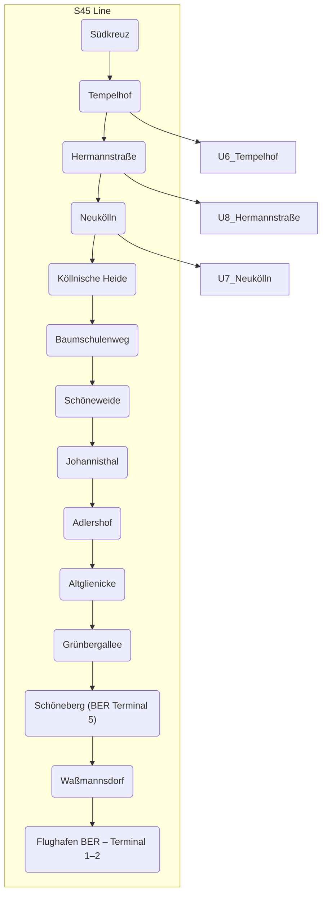

## Confidential Links & Embeds: 

### #is_/same_as :: [[/_Standards/Earth/Continent/Europe/Europe~Central/Germany/Germany~West/Berlin,State/S-Bahn,Berlin/S45,Berlin|S45,Berlin]] 

### #is_/same_as :: [[/_public/Earth/Continent/Europe/Europe~Central/Germany/Germany~West/Berlin,State/S-Bahn,Berlin/S45,Berlin.public|S45,Berlin.public]] 

### #is_/same_as :: [[/_internal/Earth/Continent/Europe/Europe~Central/Germany/Germany~West/Berlin,State/S-Bahn,Berlin/S45,Berlin.internal|S45,Berlin.internal]] 

### #is_/same_as :: [[/_protect/Earth/Continent/Europe/Europe~Central/Germany/Germany~West/Berlin,State/S-Bahn,Berlin/S45,Berlin.protect|S45,Berlin.protect]] 

### #is_/same_as :: [[/_private/Earth/Continent/Europe/Europe~Central/Germany/Germany~West/Berlin,State/S-Bahn,Berlin/S45,Berlin.private|S45,Berlin.private]] 

### #is_/same_as :: [[/_personal/Earth/Continent/Europe/Europe~Central/Germany/Germany~West/Berlin,State/S-Bahn,Berlin/S45,Berlin.personal|S45,Berlin.personal]] 

### #is_/same_as :: [[/_secret/Earth/Continent/Europe/Europe~Central/Germany/Germany~West/Berlin,State/S-Bahn,Berlin/S45,Berlin.secret|S45,Berlin.secret]] 

