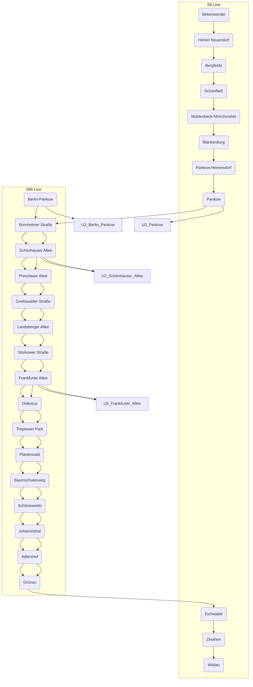

## Confidential Links & Embeds: 

### #is_/same_as :: [[/_Standards/Earth/Continent/Europe/Europe~Central/Germany/Germany~West/Berlin,State/S-Bahn,Berlin/S8,Berlin|S8,Berlin]] 

### #is_/same_as :: [[/_public/Earth/Continent/Europe/Europe~Central/Germany/Germany~West/Berlin,State/S-Bahn,Berlin/S8,Berlin.public|S8,Berlin.public]] 

### #is_/same_as :: [[/_internal/Earth/Continent/Europe/Europe~Central/Germany/Germany~West/Berlin,State/S-Bahn,Berlin/S8,Berlin.internal|S8,Berlin.internal]] 

### #is_/same_as :: [[/_protect/Earth/Continent/Europe/Europe~Central/Germany/Germany~West/Berlin,State/S-Bahn,Berlin/S8,Berlin.protect|S8,Berlin.protect]] 

### #is_/same_as :: [[/_private/Earth/Continent/Europe/Europe~Central/Germany/Germany~West/Berlin,State/S-Bahn,Berlin/S8,Berlin.private|S8,Berlin.private]] 

### #is_/same_as :: [[/_personal/Earth/Continent/Europe/Europe~Central/Germany/Germany~West/Berlin,State/S-Bahn,Berlin/S8,Berlin.personal|S8,Berlin.personal]] 

### #is_/same_as :: [[/_secret/Earth/Continent/Europe/Europe~Central/Germany/Germany~West/Berlin,State/S-Bahn,Berlin/S8,Berlin.secret|S8,Berlin.secret]] 

