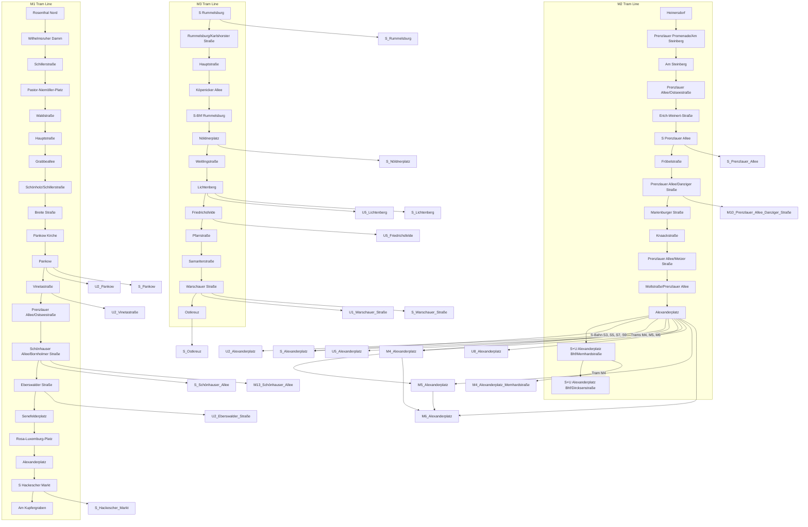

## #has_/text_of_/abstract 

>  The Berlin tramway (German: Straßenbahn Berlin) is the main tram system in Berlin, Germany.  
>  It is one of the oldest tram networks in the world having its origins in 1865 
>  and is operated by Berliner Verkehrsbetriebe (BVG), which was founded in 1929. 
>  
>  It is notable for being the third-largest tram system in the world, after Melbourne and St. Petersburg. 
>  
>  Berlin's tram system is made up of 22 lines that operate across a standard gauge network, 
>  with almost 800 stops and measuring almost 190 kilometres (120 mi) in route length 
>  and 430 kilometres (270 mi) in line length. 
>  
>  Nine of the lines, M1 - M9 called Metrotram, operate 24 hours a day 
>  and are identified with the letter "M" before their number; 
>  the other thirteen lines are regular city tram lines and are identified by just a line number.
>
> Most of the current network is within the confines of the former East Berlin, 
> as tram lines within West Berlin were replaced by buses during the division of Berlin. 
> 
> However, the first extension into West Berlin opened in 1994 on today's M13. 
> In the eastern vicinity of the city there are also three private tram lines 
> that are not part of the main system; 
> the Potsdam tram system, with its own network of lines, is just to the south-west of Berlin.
>
> [Wikipedia](https://en.wikipedia.org/wiki/Trams%20in%20Berlin)

## #has_/parts 

### [[Tram,Berlin/M1,Berlin]] 

### [[Tram,Berlin/M2,Berlin]] 

### [[Tram,Berlin/M3,Berlin]] 

### [[Tram,Berlin/M4,Berlin]] 

### [[Tram,Berlin/M5,Berlin]] 

### [[Tram,Berlin/M6,Berlin]] 

### [[Tram,Berlin/M7,Berlin]] 

### [[Tram,Berlin/M8,Berlin]] 

### [[Tram,Berlin/M9,Berlin]] 

### [[Tram12,Berlin]] 

### [[Tram16,Berlin]] 

### [[Tram18,Berlin]] 

### [[Tram21,Berlin]] 

### [[Tram27,Berlin]] 

### [[Tram37,Berlin]] 

### [[Tram50,Berlin]] 

### [[Tram60,Berlin]] 

### [[Tram61,Berlin]] 

### [[Tram62,Berlin]] 

### [[Tram63,Berlin]] 

### [[Tram67,Berlin]] 

### [[Tram68,Berlin]] 

## #has_/diagram 

## Confidential Links & Embeds: 

### #is_/same_as :: [Tram,Berlin](Tram,Berlin.md) 

### #is_/same_as :: [Tram,Berlin.public](/_public/Earth/Continent/Europe/Europe~Central/Germany/Germany~West/State~Berlin/cities~Berlin/cities~Berlin/Berlin-city/Tram,Berlin.public.md) 

### #is_/same_as :: [Tram,Berlin.internal](/_internal/Earth/Continent/Europe/Europe~Central/Germany/Germany~West/State~Berlin/cities~Berlin/cities~Berlin/Berlin-city/Tram,Berlin.internal.md) 

### #is_/same_as :: [Tram,Berlin.protect](/_protect/Earth/Continent/Europe/Europe~Central/Germany/Germany~West/State~Berlin/cities~Berlin/cities~Berlin/Berlin-city/Tram,Berlin.protect.md) 

### #is_/same_as :: [Tram,Berlin.private](/_private/Earth/Continent/Europe/Europe~Central/Germany/Germany~West/State~Berlin/cities~Berlin/cities~Berlin/Berlin-city/Tram,Berlin.private.md) 

### #is_/same_as :: [Tram,Berlin.personal](/_personal/Earth/Continent/Europe/Europe~Central/Germany/Germany~West/State~Berlin/cities~Berlin/cities~Berlin/Berlin-city/Tram,Berlin.personal.md) 

### #is_/same_as :: [Tram,Berlin.secret](/_secret/Earth/Continent/Europe/Europe~Central/Germany/Germany~West/State~Berlin/cities~Berlin/cities~Berlin/Berlin-city/Tram,Berlin.secret.md)

