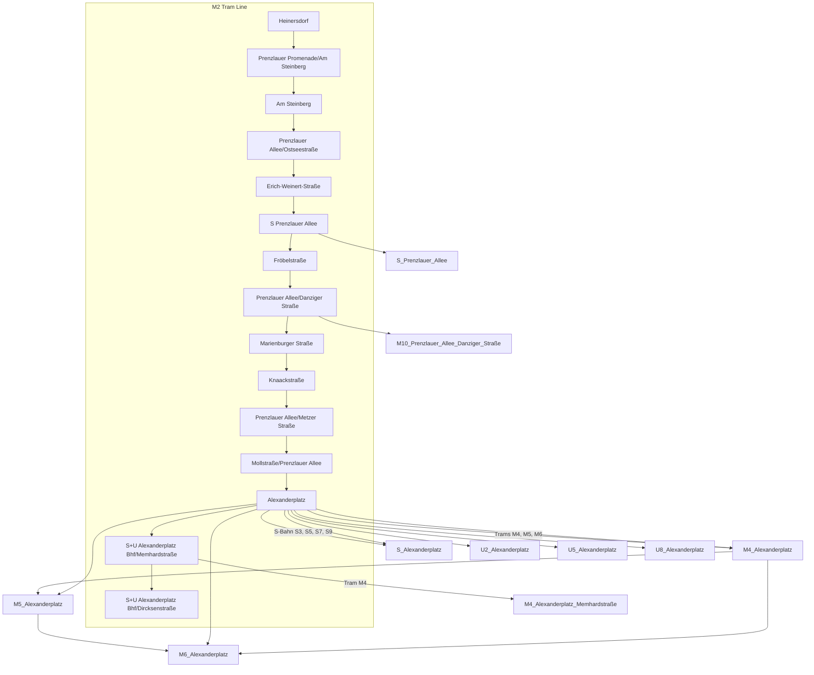

---
dv_is_:
  same_as:
    - "[[/_Standards/Earth/Continent/Europe/Europe~Central/Germany/Germany~West/Berlin,State/Tram,Berlin/M2,Berlin|M2,Berlin]]"
    - "[[/_public/Earth/Continent/Europe/Europe~Central/Germany/Germany~West/Berlin,State/Tram,Berlin/M2,Berlin.public|M2,Berlin.public]]"
    - "[[/_internal/Earth/Continent/Europe/Europe~Central/Germany/Germany~West/Berlin,State/Tram,Berlin/M2,Berlin.internal|M2,Berlin.internal]]"
    - "[[/_protect/Earth/Continent/Europe/Europe~Central/Germany/Germany~West/Berlin,State/Tram,Berlin/M2,Berlin.protect|M2,Berlin.protect]]"
    - "[[/_private/Earth/Continent/Europe/Europe~Central/Germany/Germany~West/Berlin,State/Tram,Berlin/M2,Berlin.private|M2,Berlin.private]]"
    - "[[/_personal/Earth/Continent/Europe/Europe~Central/Germany/Germany~West/Berlin,State/Tram,Berlin/M2,Berlin.personal|M2,Berlin.personal]]"
    - "[[/_secret/Earth/Continent/Europe/Europe~Central/Germany/Germany~West/Berlin,State/Tram,Berlin/M2,Berlin.secret|M2,Berlin.secret]]"
dv_is_same_as:
  - "[[/_Standards/Earth/Continent/Europe/Europe~Central/Germany/Germany~West/Berlin,State/Tram,Berlin/M2,Berlin|M2,Berlin]]"
  - "[[/_public/Earth/Continent/Europe/Europe~Central/Germany/Germany~West/Berlin,State/Tram,Berlin/M2,Berlin.public|M2,Berlin.public]]"
  - "[[/_internal/Earth/Continent/Europe/Europe~Central/Germany/Germany~West/Berlin,State/Tram,Berlin/M2,Berlin.internal|M2,Berlin.internal]]"
  - "[[/_protect/Earth/Continent/Europe/Europe~Central/Germany/Germany~West/Berlin,State/Tram,Berlin/M2,Berlin.protect|M2,Berlin.protect]]"
  - "[[/_private/Earth/Continent/Europe/Europe~Central/Germany/Germany~West/Berlin,State/Tram,Berlin/M2,Berlin.private|M2,Berlin.private]]"
  - "[[/_personal/Earth/Continent/Europe/Europe~Central/Germany/Germany~West/Berlin,State/Tram,Berlin/M2,Berlin.personal|M2,Berlin.personal]]"
  - "[[/_secret/Earth/Continent/Europe/Europe~Central/Germany/Germany~West/Berlin,State/Tram,Berlin/M2,Berlin.secret|M2,Berlin.secret]]"
---

## Confidential Links & Embeds: 

### #is_/same_as :: [[/_Standards/Earth/Continent/Europe/Europe~Central/Germany/Germany~West/Berlin,State/Tram,Berlin/M2,Berlin|M2,Berlin]] 

### #is_/same_as :: [[/_public/Earth/Continent/Europe/Europe~Central/Germany/Germany~West/Berlin,State/Tram,Berlin/M2,Berlin.public|M2,Berlin.public]] 

### #is_/same_as :: [[/_internal/Earth/Continent/Europe/Europe~Central/Germany/Germany~West/Berlin,State/Tram,Berlin/M2,Berlin.internal|M2,Berlin.internal]] 

### #is_/same_as :: [[/_protect/Earth/Continent/Europe/Europe~Central/Germany/Germany~West/Berlin,State/Tram,Berlin/M2,Berlin.protect|M2,Berlin.protect]] 

### #is_/same_as :: [[/_private/Earth/Continent/Europe/Europe~Central/Germany/Germany~West/Berlin,State/Tram,Berlin/M2,Berlin.private|M2,Berlin.private]] 

### #is_/same_as :: [[/_personal/Earth/Continent/Europe/Europe~Central/Germany/Germany~West/Berlin,State/Tram,Berlin/M2,Berlin.personal|M2,Berlin.personal]] 

### #is_/same_as :: [[/_secret/Earth/Continent/Europe/Europe~Central/Germany/Germany~West/Berlin,State/Tram,Berlin/M2,Berlin.secret|M2,Berlin.secret]] 

