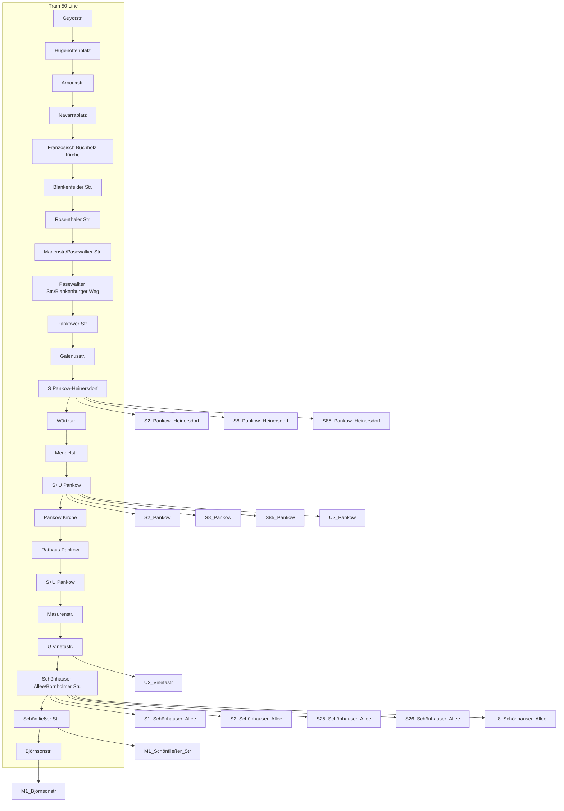

## #has_/diagram 

## Confidential Links & Embeds: 

### #is_/same_as :: [T50,Berlin](T50,Berlin.md) 

### #is_/same_as :: [T50,Berlin.public](/_public/Earth/Continent/Europe/Europe~Central/Germany/Germany~West/State~Berlin/cities~Berlin/cities~Berlin/Berlin-city/Tram,Berlin/T50,Berlin.public.md) 

### #is_/same_as :: [T50,Berlin.internal](/_internal/Earth/Continent/Europe/Europe~Central/Germany/Germany~West/State~Berlin/cities~Berlin/cities~Berlin/Berlin-city/Tram,Berlin/T50,Berlin.internal.md) 

### #is_/same_as :: [T50,Berlin.protect](/_protect/Earth/Continent/Europe/Europe~Central/Germany/Germany~West/State~Berlin/cities~Berlin/cities~Berlin/Berlin-city/Tram,Berlin/T50,Berlin.protect.md) 

### #is_/same_as :: [T50,Berlin.private](/_private/Earth/Continent/Europe/Europe~Central/Germany/Germany~West/State~Berlin/cities~Berlin/cities~Berlin/Berlin-city/Tram,Berlin/T50,Berlin.private.md) 

### #is_/same_as :: [T50,Berlin.personal](/_personal/Earth/Continent/Europe/Europe~Central/Germany/Germany~West/State~Berlin/cities~Berlin/cities~Berlin/Berlin-city/Tram,Berlin/T50,Berlin.personal.md) 

### #is_/same_as :: [T50,Berlin.secret](/_secret/Earth/Continent/Europe/Europe~Central/Germany/Germany~West/State~Berlin/cities~Berlin/cities~Berlin/Berlin-city/Tram,Berlin/T50,Berlin.secret.md)

