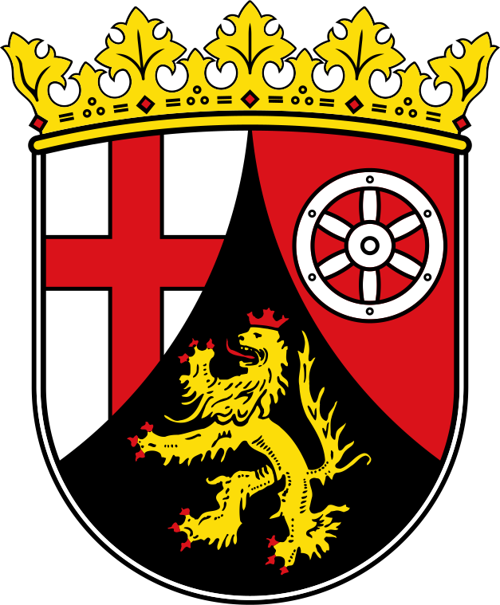

---
aliases:
  - Rhineland-Palatinate
  - Rheinland-Pfalz
has_id_wikidata: Q1200
archives_at: "[[_Standards/WikiData/WD~Landeshauptarchiv Koblenz]]"
area: 19853.36
award_received: "[[_Standards/WikiData/WD~BigBrotherAwards]]"
capital: "[[_Standards/WikiData/WD~Mainz]]"
category_for_honorary_citizens_of_entity: "[[_Standards/WikiData/WD~Q19473381]]"
coat_of_arms: "[[_Standards/WikiData/WD~coat of arms of Rhineland-Palatinate]]"
coat_of_arms_image: http://commons.wikimedia.org/wiki/Special:FilePath/Coat%20of%20arms%20of%20Rhineland-Palatinate.svg
Commons_category: Rhineland-Palatinate
Commons_gallery: Rheinland-Pfalz
Confidential: public
contains_the_administrative_territorial_entity:
  - "[[_Standards/WikiData/WD~Rheinhessen-Pfalz]]"
  - "[[_Standards/WikiData/WD~Trier Government Region]]"
  - "[[_Standards/WikiData/WD~Koblenz Government Region]]"
  - "[[_Standards/WikiData/WD~Montabaur Government Region]]"
  - "[[_Standards/WikiData/WD~Q2137712]]"
  - "[[_Standards/WikiData/WD~Rheinhessen Government Region]]"
  - "[[_Standards/WikiData/WD~Mainz]]"
  - "[[_Standards/WikiData/WD~Ludwigshafen]]"
  - "[[_Standards/WikiData/WD~Koblenz]]"
  - "[[_Standards/WikiData/WD~Trier]]"
  - "[[_Standards/WikiData/WD~Kaiserslautern]]"
  - "[[_Standards/WikiData/WD~Worms]]"
  - "[[_Standards/WikiData/WD~Neustadt an der Weinstraße]]"
  - "[[_Standards/WikiData/WD~Speyer]]"
  - "[[_Standards/WikiData/WD~Frankenthal]]"
  - "[[_Standards/WikiData/WD~Landau in der Pfalz]]"
  - "[[_Standards/WikiData/WD~Germersheim]]"
  - "[[_Standards/WikiData/WD~Südliche Weinstraße]]"
  - "[[_Standards/WikiData/WD~Rhein-Pfalz]]"
  - "[[_Standards/WikiData/WD~Südwestpfalz]]"
  - "[[_Standards/WikiData/WD~Kaiserslautern]]"
  - "[[_Standards/WikiData/WD~Bad Dürkheim (district)]]"
  - "[[_Standards/WikiData/WD~Kusel]]"
  - "[[_Standards/WikiData/WD~Alzey-Worms]]"
  - "[[_Standards/WikiData/WD~Donnersbergkreis]]"
  - "[[_Standards/WikiData/WD~Mainz-Bingen]]"
  - "[[_Standards/WikiData/WD~Rhein-Hunsrück-Kreis]]"
  - "[[_Standards/WikiData/WD~Birkenfeld]]"
  - "[[_Standards/WikiData/WD~Bad Kreuznach]]"
  - "[[_Standards/WikiData/WD~Trier-Saarburg]]"
  - "[[_Standards/WikiData/WD~Vulkaneifel]]"
  - "[[_Standards/WikiData/WD~Eifelkreis Bitburg-Prüm]]"
  - "[[_Standards/WikiData/WD~Bernkastel-Wittlich]]"
  - "[[_Standards/WikiData/WD~Cochem-Zell]]"
  - "[[_Standards/WikiData/WD~Mayen-Koblenz]]"
  - "[[_Standards/WikiData/WD~Ahrweiler]]"
  - "[[_Standards/WikiData/WD~Westerwaldkreis]]"
  - "[[_Standards/WikiData/WD~Rhein-Lahn-Kreis]]"
  - "[[_Standards/WikiData/WD~Neuwied]]"
  - "[[_Standards/WikiData/WD~Altenkirchen district]]"
  - "[[_Standards/WikiData/WD~Pirmasens]]"
  - "[[_Standards/WikiData/WD~Zweibrücken]]"
coordinate_location: Point(7.449722 49.913056)
country: "[[_Standards/WikiData/WD~Germany]]"
cssclasses:
  - state
described_by_source:
  - "[[_Standards/WikiData/WD~Armenian Soviet Encyclopedia]]"
Dewey_Decimal_Classification: 2--4343
economy_of_topic: "[[_Standards/WikiData/WD~economy of Rhineland-Palatinate]]"
elevation_above_sea_level: 89
expiryDate: ""
Facebook_username: landesregierungrheinlandpfalz
FIPS_10_4_countries_and_regions_: GM08
flag: "[[_Standards/WikiData/WD~flag of Rhineland-Palatinate]]"
flag_image: http://commons.wikimedia.org/wiki/Special:FilePath/Flag%20of%20Rhineland-Palatinate.svg
geoshape: http://commons.wikimedia.org/data/main/Data:Rheinland-Pfalz.map
German_regional_key: 7
HASC:
  - DE.RP
has_time_started: 1946-08-30
head_of_government: "[[_Standards/WikiData/WD~Malu Dreyer]]"
highest_judicial_authority: "[[_Standards/WikiData/WD~Constitutional Court of Rhineland-Palatinate]]"
highest_point: "[[_Standards/WikiData/WD~Erbeskopf]]"
history_of_topic: "[[_Standards/WikiData/WD~history of Rhineland-Palatinate]]"
icon: Flag_of_Rhineland-Palatinate
image: http://commons.wikimedia.org/wiki/Special:FilePath/Mainz%20Deutschhaus%20BW%202012-08-18%2013-28-02.jpg
inception: 1946-08-30
Instagram_username: ministerpraesidentin.rlp
instance_of:
  - "[[_Standards/WikiData/WD~federated state of Germany]]"
isDeleted: false
ISO3166_2: DE-RP
ISO_3166_2_code: DE-RP
keywords: ""
language_used:
  - "[[_Standards/WikiData/WD~Luxembourgish]]"
  - "[[_Standards/WikiData/WD~Palatinate German]]"
layout: ""
legislative_body:
  - "[[_Standards/WikiData/WD~Landtag of Rhineland-Palatinate]]"
linkTitle: ""
located_in_the_administrative_territorial_entity: "[[_Standards/WikiData/WD~Germany]]"
located_in_time_zone:
  - "[[_Standards/WikiData/WD~UTC+01:00]]"
  - "[[_Standards/WikiData/WD~UTC+02:00]]"
location:
  - 49.914
  - 7.57652
locator_map_image: http://commons.wikimedia.org/wiki/Special:FilePath/Locator%20map%20Rhineland-Palatinate%20in%20Germany.svg
lowest_point: "[[_Standards/WikiData/WD~Nonnenwerth]]"
native_label:
  - Rheinland-Pfalz
NUTS_code: DEB
office_held_by_head_of_government: "[[_Standards/WikiData/WD~Minister-President of Rhineland-Palatinate]]"
official_name: Rheinland-Pfalz
official_website: https://www.rlp.de/
OmegaWiki_Defined_Meaning: 642911
open_data_portal:
  - "[[_Standards/WikiData/WD~Open-Government-Data-Portal Rheinland-Pfalz]]"
page_banner: http://commons.wikimedia.org/wiki/Special:FilePath/Rhine%20valley%20banner.jpg
permanent_duplicated_item:
  - "[[_Standards/WikiData/WD~Q25930020]]"
population: 4084844
pronunciation_audio: http://commons.wikimedia.org/wiki/Special:FilePath/De-Rheinland-Pfalz2.ogg
publish: true
publishDate: ""
shares_border_with:
  - "[[_Standards/WikiData/WD~Lorraine]]"
  - "[[_Standards/WikiData/WD~Baden-Württemberg]]"
  - "[[_Standards/WikiData/WD~Province of Liege]]"
  - "[[_Standards/WikiData/WD~North Rhine-Westphalia]]"
  - "[[_Standards/WikiData/WD~Hesse]]"
  - "[[_Standards/WikiData/WD~Saarland]]"
  - "[[_Standards/WikiData/WD~Moselle]]"
  - "[[_Standards/WikiData/WD~Bas-Rhin]]"
  - "[[_Standards/WikiData/WD~Wallonia]]"
SpocWebEntityId: 36021
tags:
  - geo/State
topic_s_main_Wikimedia_portal: "[[_Standards/WikiData/WD~Portal:Rhineland-Palatinate]]"
type: State
X_username: rlpNews
dv_has_name: Rheinland-Pfalz
dv_has_name_abbreviated: RZ
dv_is_:
  same_as:
    - "[[../../../../../../WikiData/WD~Rhineland-Palatinate,1201|WD~Rhineland-Palatinate,1201]]"
    - "[[/_Standards/Earth/Continent/Europe/Europe~Central/Germany/Germany~West/Rheinland-Pfalz|Rheinland-Pfalz]]"
    - "[[/_public/Earth/Continent/Europe/Europe~Central/Germany/Germany~West/Rheinland-Pfalz.public|Rheinland-Pfalz.public]]"
    - "[[/_internal/Earth/Continent/Europe/Europe~Central/Germany/Germany~West/Rheinland-Pfalz.internal|Rheinland-Pfalz.internal]]"
    - "[[/_protect/Earth/Continent/Europe/Europe~Central/Germany/Germany~West/Rheinland-Pfalz.protect|Rheinland-Pfalz.protect]]"
    - "[[/_private/Earth/Continent/Europe/Europe~Central/Germany/Germany~West/Rheinland-Pfalz.private|Rheinland-Pfalz.private]]"
    - "[[/_personal/Earth/Continent/Europe/Europe~Central/Germany/Germany~West/Rheinland-Pfalz.personal|Rheinland-Pfalz.personal]]"
    - "[[/_secret/Earth/Continent/Europe/Europe~Central/Germany/Germany~West/Rheinland-Pfalz.secret|Rheinland-Pfalz.secret]]"
dv_has_:
  name_:
  url_for_:
    code_repository: https://github.com/SpocWiki/Germany-Rheinland-Pfalz
  image_for_:
    coat_of_arms: "![[./Rheinland-Pfalz/Coat_of_arms_of_Rhineland-Palatinate.svg|250]]"
    flag: "![[./Rheinland-Pfalz/Flag_of_Rhineland-Palatinate.svg|200]] "
  map: "[DEU-Germany-1580-Rheinland-Pfalz.geojson](./Rheinland-Pfalz/DEU-Germany-1580-Rheinland-Pfalz.geojson)"
dv_has_place_country: "[[../../Germany]]"
dv_is_a_: "[[../../../../../Geography/Place]]"
dv_has_place_longitude: 7.57652
dv_has_place_latitude: 49.914
dv_is_same_as:
  - "[[../../../../../../WikiData/WD~Rhineland-Palatinate,1201|WD~Rhineland-Palatinate,1201]]"
  - "[[/_Standards/Earth/Continent/Europe/Europe~Central/Germany/Germany~West/Rheinland-Pfalz|Rheinland-Pfalz]]"
  - "[[/_public/Earth/Continent/Europe/Europe~Central/Germany/Germany~West/Rheinland-Pfalz.public|Rheinland-Pfalz.public]]"
  - "[[/_internal/Earth/Continent/Europe/Europe~Central/Germany/Germany~West/Rheinland-Pfalz.internal|Rheinland-Pfalz.internal]]"
  - "[[/_protect/Earth/Continent/Europe/Europe~Central/Germany/Germany~West/Rheinland-Pfalz.protect|Rheinland-Pfalz.protect]]"
  - "[[/_private/Earth/Continent/Europe/Europe~Central/Germany/Germany~West/Rheinland-Pfalz.private|Rheinland-Pfalz.private]]"
  - "[[/_personal/Earth/Continent/Europe/Europe~Central/Germany/Germany~West/Rheinland-Pfalz.personal|Rheinland-Pfalz.personal]]"
  - "[[/_secret/Earth/Continent/Europe/Europe~Central/Germany/Germany~West/Rheinland-Pfalz.secret|Rheinland-Pfalz.secret]]"
dv_has_url_for_code_repository: https://github.com/SpocWiki/Germany-Rheinland-Pfalz
dv_has_image_for_coat_of_arms: "![[./Rheinland-Pfalz/Coat_of_arms_of_Rhineland-Palatinate.svg|250]]"
dv_has_image_for_flag: "![[./Rheinland-Pfalz/Flag_of_Rhineland-Palatinate.svg|200]] "
dv_has_map: "[DEU-Germany-1580-Rheinland-Pfalz.geojson](./Rheinland-Pfalz/DEU-Germany-1580-Rheinland-Pfalz.geojson)"
---

# [[Rheinland-Pfalz]] 

name = `=this.dv_has_name` 

has_name_abbreviated = `=this.dv_has_name_abbreviated` 

is_a_ = `=this.dv_is_a_`

has_url_for_code_repository = `=this.dv_has_url_for_code_repository`

This Repository/Folder/Wiki/Vault contains freely usable Text and Data 
covering the German state of [Rhineland-Palatinate](https://en.wikipedia.org/wiki/Rhineland-Palatinate).   

This Repository is intended to be shared as a common basis, 
by including it as a Sub-Repository in local File-Systems, 
specifically as part of the [\_Standards](https://github.com/SpocWiki/_Standards) Repository. 

Check out this Repository into this Subfolder: 
\_Standards\geo\Continent\Europe\Europe~Central\Germany\Germany~West\Rheinland-Pfalz 


## #has_/text_of_/abstract  


> **Rhineland-Palatinate** is a western state of Germany. 
> It covers 19,846 km² and has about 4.05 million residents. 
> It is the ninth largest and sixth most populous of the sixteen states. 
> Mainz is the capital and largest city. Other cities are Ludwigshafen am Rhein, 
> Koblenz, Trier, Kaiserslautern, Worms and Neuwied. 
> It is bordered by North Rhine-Westphalia, Saarland, Baden-Württemberg and Hesse 
> and by France, Luxembourg and Belgium.
>
> Rhineland-Palatinate was established in 1946 after World War II, from parts of the 
> former states of Prussia (part of its Rhineland and Nassau provinces), 
> Hesse (Rhenish Hesse) and Bavaria (its former outlying Palatinate kreis or district), 
> by the French military administration in Allied-occupied Germany. 
> 
> Rhineland-Palatinate became part of the Federal Republic of Germany in 1949 
> and shared the country's only border with the Saar Protectorate 
> until the latter was returned to German control in 1957. 
> 
> Rhineland-Palatinate's natural and cultural heritage includes 
> the extensive Palatinate winegrowing region, picturesque landscapes, 
> and many castles and palaces. 
> 
> Rhineland-Palatinate is currently the only federal state in Germany 
> where nuclear weapons are stored extraterritorially 
> under the responsibility and supervision of US forces.
>
> [Wikipedia](https://en.wikipedia.org/wiki/Rhineland-Palatinate) 


## Maps and Flags 

### #has_/image_for_/coat_of_arms 


has_image_for_coat_of_arms = `=this.dv_has_image_for_coat_of_arms`

### #has_/image_for_/flag


has_image_for_flag = `=this.dv_has_image_for_flag`


###has_map = `=this.dv_has_map`


```leaflet
id: Rheinland-Pfalz
zoomFeatures: true 
minZoom: 4 
maxZoom: 18
geojsonFolder: ./Rheinland-Pfalz/
markerFolder: ./Rheinland-Pfalz/
```

has_place_country = `=this.dv_has_place_country`
Capital :: [[Mainz]]  
#is_a_/Place  
is_a_ = `=this.dv_is_a_`
has_place_longitude = `=this.dv_has_place_longitude` 
has_place_latitude = `=this.dv_has_place_latitude` 
[Population::] 


## Confidential Links & Embeds: 

### #is_/same_as :: [[/_Standards/Earth/Continent/Europe/Europe~Central/Germany/Germany~West/Rheinland-Pfalz|Rheinland-Pfalz]] 

### #is_/same_as :: [[/_public/Earth/Continent/Europe/Europe~Central/Germany/Germany~West/Rheinland-Pfalz.public|Rheinland-Pfalz.public]] 

### #is_/same_as :: [[/_internal/Earth/Continent/Europe/Europe~Central/Germany/Germany~West/Rheinland-Pfalz.internal|Rheinland-Pfalz.internal]] 

### #is_/same_as :: [[/_protect/Earth/Continent/Europe/Europe~Central/Germany/Germany~West/Rheinland-Pfalz.protect|Rheinland-Pfalz.protect]] 

### #is_/same_as :: [[/_private/Earth/Continent/Europe/Europe~Central/Germany/Germany~West/Rheinland-Pfalz.private|Rheinland-Pfalz.private]] 

### #is_/same_as :: [[/_personal/Earth/Continent/Europe/Europe~Central/Germany/Germany~West/Rheinland-Pfalz.personal|Rheinland-Pfalz.personal]] 

### #is_/same_as :: [[/_secret/Earth/Continent/Europe/Europe~Central/Germany/Germany~West/Rheinland-Pfalz.secret|Rheinland-Pfalz.secret]] 

