## #has_/text_of_/abstract 

> S2 is a line on the Berlin S-Bahn. It operates from Bernau to Blankenfelde over:
> - the Berlin-Szczecin railway, opened on 1 August 1842 and electrified on 8 August 1924,
> - the Nord-Süd-Tunnel, opened on 28 May 1936 from Humboldthain to Unter den Linden and on 6 November 1939 to Anhalter Bahnhof and Priesterweg
> - the Berlin–Dresden railway, opened on 17 June 1875 and electrified on 15 May 1933.
>
> Since becoming a numbered route in 1984, the S2's line colour is green.
>
> [Wikipedia](https://en.wikipedia.org/wiki/S2%20(Berlin))
> 

## #has_/diagram 

```mermaid
graph TD



%% Class Definitions %%
classDef greenText fill:#6ECF68,stroke:#2E7D32,stroke-width:2px,color:#FFF;
classDef redText fill:#E57373,stroke:#C62828,stroke-width:2px,color:#FFF;
classDef blueText fill:#64B5F6,stroke:#1565C0,stroke-width:2px,color:#FFF;
classDef cyanText fill:#6CC,stroke:#2E7D32,stroke-width:2px,color:#FFF;
classDef magentaText fill:#C6C,stroke:#C62828,stroke-width:2px,color:#FFF;
classDef orangeText fill:#FA0,stroke:#1565C0,stroke-width:2px,color:#FFF;
classDef brownText fill:#A33,stroke:#1565C0,stroke-width:2px,color:#FFF;
classDef oliveText fill:#880,stroke:#1565C0,stroke-width:2px,color:#FFF;
classDef yellowText fill:#FF0,stroke:#1565C0,stroke-width:2px,color:#000;
classDef pinkText fill:#FBC,stroke:#1565C0,stroke-width:2px,color:#FFF;




subgraph S2 ["S2 Line"]
S2_Bernau("Bernau") --> 
S2_Bernau_Friedenstal("Bernau-Friedenstal") --> 
S2_Zepernick("Zepernick") --> 
S2_Röntgental("Röntgental") --> 
S2_Buch("Buch") --> 
S2_Karow("Karow") --> 
S2_Blankenburg("Blankenburg") --> 
S2_Pankow_Heinersdorf("Pankow-Heinersdorf") --> 
S2_Pankow("Pankow") --> 
S2_Bornholmer_Straße("Bornholmer Straße") --> 
S2_Gesundbrunnen("Gesundbrunnen") --> 
S2_Humboldthain("Humboldthain") --> 
S2_Nordbahnhof("Nordbahnhof") --> 
S2_Oranienburger_Straße("Oranienburger Straße") --> 
S2_Friedrichstraße("Friedrichstraße") --> 
S2_Brandenburger_Tor("Brandenburger Tor") --> 
S2_Potsdamer_Platz("Potsdamer Platz") --> 
S2_Anhalter_Bahnhof("Anhalter Bahnhof") --> 
S2_Yorckstraße("Yorckstraße") --> 
S2_Südkreuz("Südkreuz") --> 
S2_Priesterweg("Priesterweg") --> 
S2_Attilastraße("Attilastraße") --> 
S2_Marienfelde("Marienfelde") --> 
S2_Buckower_Chaussee("Buckower Chaussee") --> 
S2_Schichauweg("Schichauweg") --> 
S2_Lichtenrade("Lichtenrade") --> 
S2_Mahlow("Mahlow") --> 
S2_Blankenfelde("Blankenfelde")
end

S2_Pankow --> U2_Pankow
S2_Gesundbrunnen --> U8_Gesundbrunnen
S2_Friedrichstraße --> U6_Friedrichstraße
S2_Brandenburger_Tor --> U5_Brandenburger_Tor
S2_Potsdamer_Platz --> U2_Potsdamer_Platz
S2_Yorckstraße --> U7_Yorckstraße


class S2_Bernau,S2_Bernau_Friedenstal,S2_Zepernick,S2_Röntgental,S2_Buch,S2_Karow,S2_Blankenburg,S2_Pankow_Heinersdorf,S2_Pankow,S2_Bornholmer_Straße,S2_Gesundbrunnen,S2_Humboldthain,S2_Nordbahnhof,S2_Oranienburger_Straße,S2_Friedrichstraße,S2_Brandenburger_Tor,S2_Potsdamer_Platz,S2_Anhalter_Bahnhof,S2_Yorckstraße,S2_Südkreuz,S2_Priesterweg,S2_Attilastraße,S2_Marienfelde,S2_Buckower_Chaussee,S2_Schichauweg,S2_Lichtenrade,S2_Mahlow,S2_Blankenfelde greenText;

subgraph S26 ["S26 Line"]
S2_Waidmannslust("Waidmannslust") --> 
S2_Wittenau("Wittenau") --> 
S2_Wilhelmsruh("Wilhelmsruh") --> 
S2_Schönholz("Schönholz") --> 
S2_Wollankstraße("Wollankstraße") --> 
S2_Bornholmer_Straße("Bornholmer Straße") --> 
S2_Gesundbrunnen("Gesundbrunnen") --> 
S2_Humboldthain("Humboldthain") --> 
S2_Nordbahnhof("Nordbahnhof") --> 
S2_Oranienburger_Straße("Oranienburger Straße") --> 
S2_Friedrichstraße("Friedrichstraße") --> 
S2_Brandenburger_Tor("Brandenburger Tor") --> 
S2_Potsdamer_Platz("Potsdamer Platz") --> 
S2_Anhalter_Bahnhof("Anhalter Bahnhof") --> 
S2_Yorckstraße("Yorckstraße") --> 
S2_Südkreuz("Südkreuz") --> 
S2_Priesterweg("Priesterweg") --> 
S2_Südende("Südende") --> 
S2_Lankwitz("Lankwitz") --> 
S2_Lichterfelde_Ost("Lichterfelde Ost") --> 
S2_Osdorfer_Straße("Osdorfer Straße") --> 
S2_Lichterfelde_Süd("Lichterfelde Süd") --> 
S2_Teltow_Stadt("Teltow Stadt")
end



subgraph S25 ["S25 Line"]
S2_Hennigsdorf("Hennigsdorf") --> 
S2_Heiligensee("Heiligensee") --> 
S2_Schulzendorf("Schulzendorf") --> 
S2_Tegel("Tegel") --> 
S2_Eichborndamm("Eichborndamm") --> 
S2_Bonhoeffer("Karl-Bonhoeffer-Nervenklinik") --> 
S2_Alt_Reinickendorf("Alt-Reinickendorf") --> 
S2_Schönholz("Schönholz") --> 
S2_Wollankstraße("Wollankstraße") --> 
S2_Bornholmer_Straße("Bornholmer Straße") --> 
S2_Gesundbrunnen("Gesundbrunnen") --> 
S2_Humboldthain("Humboldthain") --> 
S2_Nordbahnhof("Nordbahnhof") --> 
S2_Oranienburger_Straße("Oranienburger Straße") --> 
S2_Friedrichstraße("Friedrichstraße") --> 
S2_Brandenburger_Tor("Brandenburger Tor") --> 
S2_Potsdamer_Platz("Potsdamer Platz") --> 
S2_Anhalter_Bahnhof("Anhalter Bahnhof") --> 
S2_Yorckstraße("Yorckstraße") --> 
S2_Südkreuz("Südkreuz") --> 
S2_Priesterweg("Priesterweg")
end

S2_Bonhoeffer --> U8_Bonhoeffer
S2_Gesundbrunnen --> U8_Gesundbrunnen
S2_Friedrichstraße --> U6_Friedrichstraße
S2_Brandenburger_Tor --> U5_Brandenburger_Tor
S2_Potsdamer_Platz --> U2_Potsdamer_Platz
S2_Yorckstraße --> U7_Yorckstraße 


class S2_Hennigsdorf,S2_Heiligensee,S2_Schulzendorf,S2_Tegel,S2_Eichborndamm,S2_Bonhoeffer,S2_Alt_Reinickendorf,S2_Schönholz,S2_Wollankstraße,S2_Bornholmer_Straße,S2_Gesundbrunnen,S2_Humboldthain,S2_Nordbahnhof,S2_Oranienburger_Straße,S2_Friedrichstraße,S2_Brandenburger_Tor,S2_Potsdamer_Platz,S2_Anhalter_Bahnhof,S2_Yorckstraße,S2_Südkreuz,S2_Priesterweg cyanText;




S2_Wittenau --> U8_Wittenau
S2_Gesundbrunnen --> U8_Gesundbrunnen
S2_Friedrichstraße --> U6_Friedrichstraße
S2_Brandenburger_Tor --> U5_Brandenburger_Tor
S2_Potsdamer_Platz --> U2_Potsdamer_Platz
S2_Yorckstraße --> U7_Yorckstraße


class S2_Waidmannslust,S2_Wittenau,S2_Wilhelmsruh,S2_Schönholz,S2_Wollankstraße,S2_Bornholmer_Straße,S2_Gesundbrunnen,S2_Humboldthain,S2_Nordbahnhof,S2_Oranienburger_Straße,S2_Friedrichstraße,S2_Brandenburger_Tor,S2_Potsdamer_Platz,S2_Anhalter_Bahnhof,S2_Yorckstraße,S2_Südkreuz,S2_Priesterweg,S2_Südende,S2_Lankwitz,S2_Lichterfelde_Ost,S2_Osdorfer_Straße,S2_Lichterfelde_Süd,S2_Teltow_Stadt oliveText;


```

## Confidential Links & Embeds: 

### [S2,Berlin](/_Standards/Earth/Continent/Europe/Europe~Central/Germany/Germany~West/State~Berlin/cities~Berlin/cities~Berlin/Berlin-city/S-Bahn,Berlin/S2,Berlin.md) 

### [S2,Berlin.public](/_public/Earth/Continent/Europe/Europe~Central/Germany/Germany~West/State~Berlin/cities~Berlin/cities~Berlin/Berlin-city/S-Bahn,Berlin/S2,Berlin.public.md) 

### [S2,Berlin.internal](/_internal/Earth/Continent/Europe/Europe~Central/Germany/Germany~West/State~Berlin/cities~Berlin/cities~Berlin/Berlin-city/S-Bahn,Berlin/S2,Berlin.internal.md) 

### [S2,Berlin.protect](/_protect/Earth/Continent/Europe/Europe~Central/Germany/Germany~West/State~Berlin/cities~Berlin/cities~Berlin/Berlin-city/S-Bahn,Berlin/S2,Berlin.protect.md) 

### [S2,Berlin.private](/_private/Earth/Continent/Europe/Europe~Central/Germany/Germany~West/State~Berlin/cities~Berlin/cities~Berlin/Berlin-city/S-Bahn,Berlin/S2,Berlin.private.md) 

### [S2,Berlin.personal](/_personal/Earth/Continent/Europe/Europe~Central/Germany/Germany~West/State~Berlin/cities~Berlin/cities~Berlin/Berlin-city/S-Bahn,Berlin/S2,Berlin.personal.md) 

### [S2,Berlin.secret](/_secret/Earth/Continent/Europe/Europe~Central/Germany/Germany~West/State~Berlin/cities~Berlin/cities~Berlin/Berlin-city/S-Bahn,Berlin/S2,Berlin.secret.md)

