- S41 runs clockwise 
- S42 runs counter-clockwise 

**S41** and **S42** operate a [circular service](https://en.wikipedia.org/wiki/Circle_route "Circle route") on the same _[Ringbahn](https://en.wikipedia.org/wiki/Berlin_Ringbahn "Berlin Ringbahn")_ and are part of the [Berlin S-Bahn](https://en.wikipedia.org/wiki/Berlin_S-Bahn "Berlin S-Bahn"). 
The S41 operates clockwise around the circle, 
the S42 operates counter-clockwise. 

```mermaid
graph TD 


subgraph S4 ["S4 Line"]
S_Gesundbrunnen("Gesundbrunnen") --> 
S_Schönhauser_Allee("Schönhauser Allee") --> 
S_Prenzlauer_Allee("Prenzlauer Allee") --> 
S_Greifswalder_Straße("Greifswalder Straße") --> 
S_Landsberger_Allee("Landsberger Allee") --> 
S_Storkower_Straße("Storkower Straße") --> 
S_Frankfurter_Allee("Frankfurter Allee") --> 
S_Ostkreuz("Ostkreuz") --> 
S_Treptower_Park("Treptower Park") --> 
S_Sonnenallee("Sonnenallee") --> 
S_Neukölln("Neukölln") --> 
S_Hermannstraße("Hermannstraße") --> 
S_Tempelhof("Tempelhof") --> 
S_Südkreuz("Südkreuz") --> 
S_Schöneberg("Schöneberg") --> 
S_Innsbrucker_Platz("Innsbrucker Platz") --> 
S_Bundesplatz("Bundesplatz") --> 
S_Heidelberger_Platz("Heidelberger Platz") --> 
S_Hohenzollerndamm("Hohenzollerndamm") --> 
S_Halensee("Halensee") --> 
S_Westkreuz("Westkreuz") --> 
S_Messe_Nord("Messe Nord/ICC") --> 
S_Westend("Westend") --> 
S_Jungfernheide("Jungfernheide") --> 
S_Beusselstraße("Beusselstraße") --> 
S_Westhafen("Westhafen") --> 
S_Wedding("Wedding") --> 
S_Gesundbrunnen("Gesundbrunnen") 
end



class S_Spandau,S_Stresow,S_Pichelsberg,S_Olympiastadion,S_Heerstraße,S_Messe_Süd,S_Westkreuz,S_Charlottenburg,S_Savignyplatz,S_Zoologischer_Garten,S_Tiergarten,S_Bellevue,S_Hauptbahnhof,S_Friedrichstraße,S_Hackescher_Markt,S_Alexanderplatz,S_Jannowitzbrücke,S_Ostbahnhof,S_Warschauer_Straße,S_Ostkreuz,S_Rummelsburg,S_Betriebsbahnhof_Rummelsburg,S_Karlshorst,S_Wuhlheide,S_Köpenick,S_Hirschgarten,S_Friedrichshagen,S_Rahnsdorf,S_Wilhelmshagen,S_Erkner blueText;

```

## Confidential Links & Embeds: 

### [S41,S42,Berlin](/_Standards/Earth/Continent/Europe/Europe~Central/Germany/Germany~West/State~Berlin/cities~Berlin/cities~Berlin/Berlin-city/S-Bahn,Berlin/S41,S42,Berlin.md) 

### [S41,S42,Berlin.public](/_public/Earth/Continent/Europe/Europe~Central/Germany/Germany~West/State~Berlin/cities~Berlin/cities~Berlin/Berlin-city/S-Bahn,Berlin/S41,S42,Berlin.public.md) 

### [S41,S42,Berlin.internal](/_internal/Earth/Continent/Europe/Europe~Central/Germany/Germany~West/State~Berlin/cities~Berlin/cities~Berlin/Berlin-city/S-Bahn,Berlin/S41,S42,Berlin.internal.md) 

### [S41,S42,Berlin.protect](/_protect/Earth/Continent/Europe/Europe~Central/Germany/Germany~West/State~Berlin/cities~Berlin/cities~Berlin/Berlin-city/S-Bahn,Berlin/S41,S42,Berlin.protect.md) 

### [S41,S42,Berlin.private](/_private/Earth/Continent/Europe/Europe~Central/Germany/Germany~West/State~Berlin/cities~Berlin/cities~Berlin/Berlin-city/S-Bahn,Berlin/S41,S42,Berlin.private.md) 

### [S41,S42,Berlin.personal](/_personal/Earth/Continent/Europe/Europe~Central/Germany/Germany~West/State~Berlin/cities~Berlin/cities~Berlin/Berlin-city/S-Bahn,Berlin/S41,S42,Berlin.personal.md) 

### [S41,S42,Berlin.secret](/_secret/Earth/Continent/Europe/Europe~Central/Germany/Germany~West/State~Berlin/cities~Berlin/cities~Berlin/Berlin-city/S-Bahn,Berlin/S41,S42,Berlin.secret.md)

