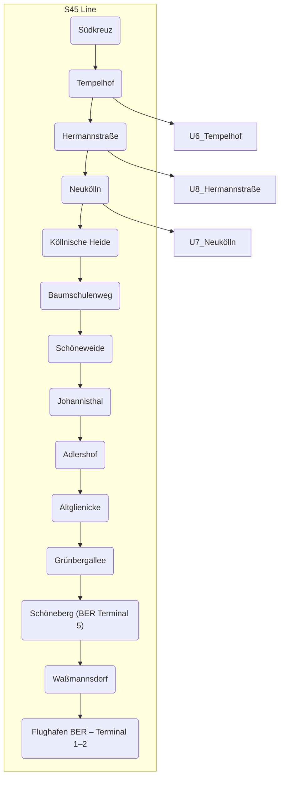

```mermaid
graph TD 


subgraph S45 ["S45 Line"]
S_Südkreuz("Südkreuz") --> 
S_Tempelhof("Tempelhof") --> 
S_Hermannstraße("Hermannstraße") --> 
S_Neukölln("Neukölln") --> 
S_Köllnische_Heide("Köllnische Heide") --> 
S_Baumschulenweg("Baumschulenweg") --> 
S_Schöneweide("Schöneweide") --> 
S_Johannisthal("Johannisthal") --> 
S_Adlershof("Adlershof") --> 
S_Altglienicke("Altglienicke") --> 
S_Grünbergallee("Grünbergallee") --> 
S_Schöneberg("Schöneberg (BER Terminal 5)") --> 
S_Waßmannsdorf("Waßmannsdorf") --> 
S_BER("Flughafen BER – Terminal 1–2") 
end

S_Tempelhof --> U6_Tempelhof
S_Hermannstraße --> U8_Hermannstraße
S_Neukölln --> U7_Neukölln


class S_Südkreuz,S_Tempelhof,S_Hermannstraße,S_Neukölln,S_Köllnische_Heide,S_Baumschulenweg,S_Schöneweide,S_Johannisthal,S_Adlershof,S_Altglienicke,S_Grünbergallee,S_Schöneberg,S_Waßmannsdorf,S_BER blueText;

```