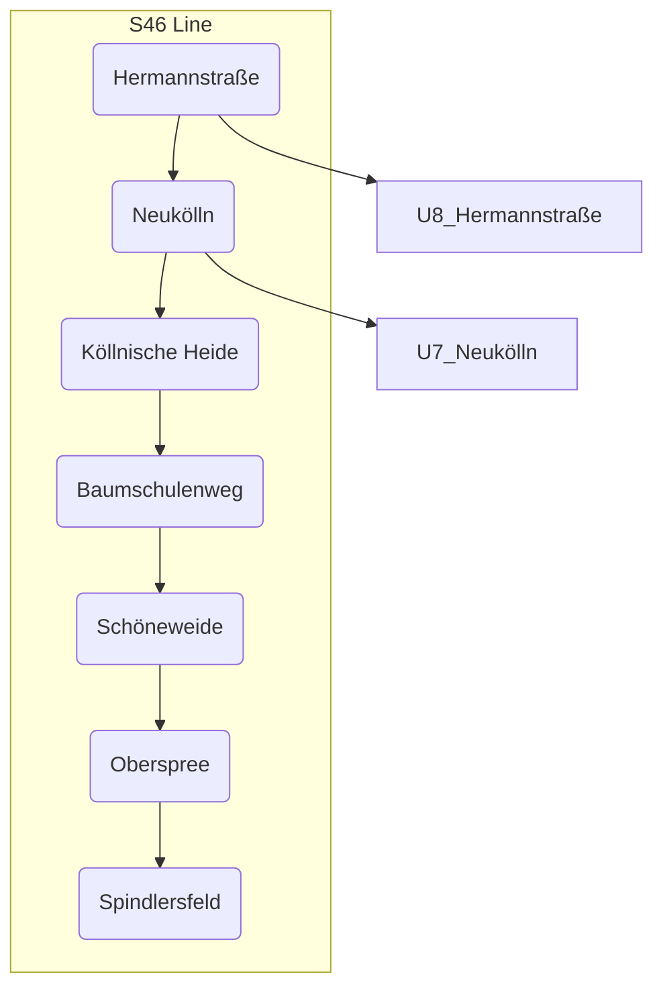

```mermaid
graph TD 


subgraph S46 ["S46 Line"]
S_Hermannstraße("Hermannstraße") --> 
S_Neukölln("Neukölln") --> 
S_Köllnische_Heide("Köllnische Heide") --> 
S_Baumschulenweg("Baumschulenweg") --> 
S_Schöneweide("Schöneweide") --> 
S_Oberspree("Oberspree") --> 
S_Spindlersfeld("Spindlersfeld")
end


S_Hermannstraße --> U8_Hermannstraße
S_Neukölln --> U7_Neukölln


class S_Hermannstraße,S_Neukölln,S_Köllnische_Heide,S_Baumschulenweg,S_Schöneweide,S_Oberspree,S_Spindlersfeld blueText;

```