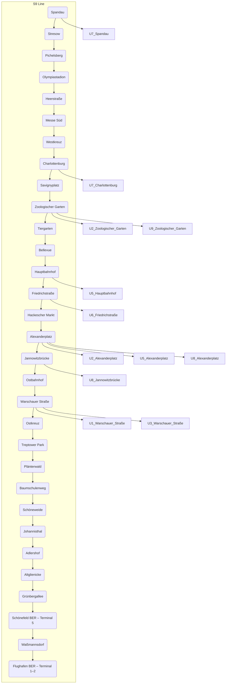

```mermaid
graph TD 

subgraph S9 ["S9 Line"]
S_Spandau("Spandau") --> 
S_Stresow("Stresow") --> 
S_Pichelsberg("Pichelsberg") --> 
S_Olympiastadion("Olympiastadion") --> 
S_Heerstraße("Heerstraße") --> 
S_Messe_Süd("Messe Süd") --> 
S_Westkreuz("Westkreuz") --> 
S_Charlottenburg("Charlottenburg") --> 
S_Savignyplatz("Savignyplatz") --> 
S_Zoologischer_Garten("Zoologischer Garten") --> 
S_Tiergarten("Tiergarten") --> 
S_Bellevue("Bellevue") --> 
S_Hauptbahnhof("Hauptbahnhof") --> 
S_Friedrichstraße("Friedrichstraße") --> 
S_Hackescher_Markt("Hackescher Markt") --> 
S_Alexanderplatz("Alexanderplatz") --> 
S_Jannowitzbrücke("Jannowitzbrücke") --> 
S_Ostbahnhof("Ostbahnhof") --> 
S_Warschauer_Straße("Warschauer Straße") --> 
S_Ostkreuz("Ostkreuz") --> 
S_Treptower_Park("Treptower Park") --> 
S_Plänterwald("Plänterwald") --> 
S_Baumschulenweg("Baumschulenweg") --> 
S_Schöneweide("Schöneweide") --> 
S_Johannisthal("Johannisthal") --> 
S_Adlershof("Adlershof") --> 
S_Altglienicke("Altglienicke") --> 
S_Grünbergallee("Grünbergallee") --> 
S_Schönefeld("Schönefeld BER – Terminal 5") --> 
S_Waßmannsdorf("Waßmannsdorf") --> 
S_BER("Flughafen BER – Terminal 1–2") 
end

S_Spandau --> U7_Spandau
S_Charlottenburg --> U7_Charlottenburg
S_Zoologischer_Garten --> U2_Zoologischer_Garten
S_Zoologischer_Garten --> U9_Zoologischer_Garten
S_Hauptbahnhof --> U5_Hauptbahnhof
S_Friedrichstraße --> U6_Friedrichstraße
S_Alexanderplatz --> U2_Alexanderplatz
S_Alexanderplatz --> U5_Alexanderplatz
S_Alexanderplatz --> U8_Alexanderplatz
S_Jannowitzbrücke --> U8_Jannowitzbrücke
S_Warschauer_Straße --> U1_Warschauer_Straße
S_Warschauer_Straße --> U3_Warschauer_Straße


class S_Spandau,S_Stresow,S_Pichelsberg,S_Olympiastadion,S_Heerstraße,S_Messe_Süd,S_Westkreuz,S_Charlottenburg,S_Savignyplatz,S_Zoologischer_Garten,S_Tiergarten,S_Bellevue,S_Hauptbahnhof,S_Friedrichstraße,S_Hackescher_Markt,S_Alexanderplatz,S_Jannowitzbrücke,S_Ostbahnhof,S_Warschauer_Straße,S_Ostkreuz,S_Treptower_Park,S_Plänterwald,S_Baumschulenweg,S_Schöneweide,S_Johannisthal,S_Adlershof,S_Altglienicke,S_Grünbergallee,S_Schönefeld,S_Waßmannsdorf,S_BER, blueText;


```