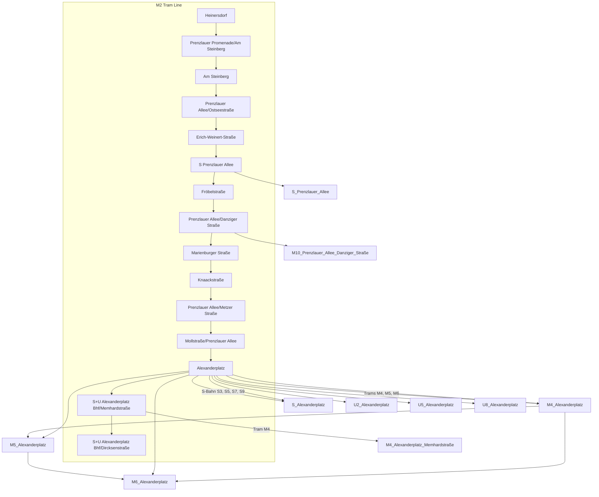

```mermaid
graph TD

  %% M2 Tram Line with Connections
  subgraph M2 ["M2 Tram Line"]
    M2_Heinersdorf["Heinersdorf"] --> M2_Prenzlauer_Promenade_Am_Steinberg["Prenzlauer Promenade/Am Steinberg"]
    M2_Prenzlauer_Promenade_Am_Steinberg --> M2_Am_Steinberg["Am Steinberg"]
    M2_Am_Steinberg --> M2_Prenzlauer_Allee_Ostseestraße["Prenzlauer Allee/Ostseestraße"]
    M2_Prenzlauer_Allee_Ostseestraße --> M2_Erich_Weinert_Straße["Erich-Weinert-Straße"]
    M2_Erich_Weinert_Straße --> M2_S_Prenzlauer_Allee["S Prenzlauer Allee"]
    M2_S_Prenzlauer_Allee --> M2_Fröbelstraße["Fröbelstraße"]
    M2_Fröbelstraße --> M2_Prenzlauer_Allee_Danziger_Straße["Prenzlauer Allee/Danziger Straße"]
    M2_Prenzlauer_Allee_Danziger_Straße --> M2_Marienburger_Straße["Marienburger Straße"]
    M2_Marienburger_Straße --> M2_Knaackstraße["Knaackstraße"]
    M2_Knaackstraße --> M2_Prenzlauer_Allee_Metzer_Straße["Prenzlauer Allee/Metzer Straße"]
    M2_Prenzlauer_Allee_Metzer_Straße --> M2_Mollstraße_Prenzlauer_Allee["Mollstraße/Prenzlauer Allee"]
    M2_Mollstraße_Prenzlauer_Allee --> M2_Alexanderplatz["Alexanderplatz"]
    M2_Alexanderplatz --> M2_Alexanderplatz_Bhf_Memhardstraße["S+U Alexanderplatz Bhf/Memhardstraße"]
    M2_Alexanderplatz_Bhf_Memhardstraße --> M2_Alexanderplatz_Bhf_Dircksenstraße["S+U Alexanderplatz Bhf/Dircksenstraße"]
  end

  %% Connections to Other Lines
  %% S Prenzlauer Allee
  M2_S_Prenzlauer_Allee --> S_Prenzlauer_Allee

  %% Prenzlauer Allee/Danziger Straße
  M2_Prenzlauer_Allee_Danziger_Straße --> M10_Prenzlauer_Allee_Danziger_Straße

  %% Alexanderplatz
  M2_Alexanderplatz -- "S-Bahn S3, S5, S7, S9" --> S_Alexanderplatz
  M2_Alexanderplatz -- "Trams M4, M5, M6" --> M4_Alexanderplatz
  M2_Alexanderplatz --> U2_Alexanderplatz
  M2_Alexanderplatz --> U5_Alexanderplatz
  M2_Alexanderplatz --> U8_Alexanderplatz
  M2_Alexanderplatz --> S_Alexanderplatz
  M2_Alexanderplatz --> M4_Alexanderplatz -->  M5_Alexanderplatz --> M6_Alexanderplatz
  M2_Alexanderplatz --> M5_Alexanderplatz
  M2_Alexanderplatz --> M6_Alexanderplatz
  M4_Alexanderplatz --> M6_Alexanderplatz


  %% S+U Alexanderplatz Bhf/Memhardstraße
  M2_Alexanderplatz_Bhf_Memhardstraße -- "Tram M4" --> M4_Alexanderplatz_Memhardstraße


```