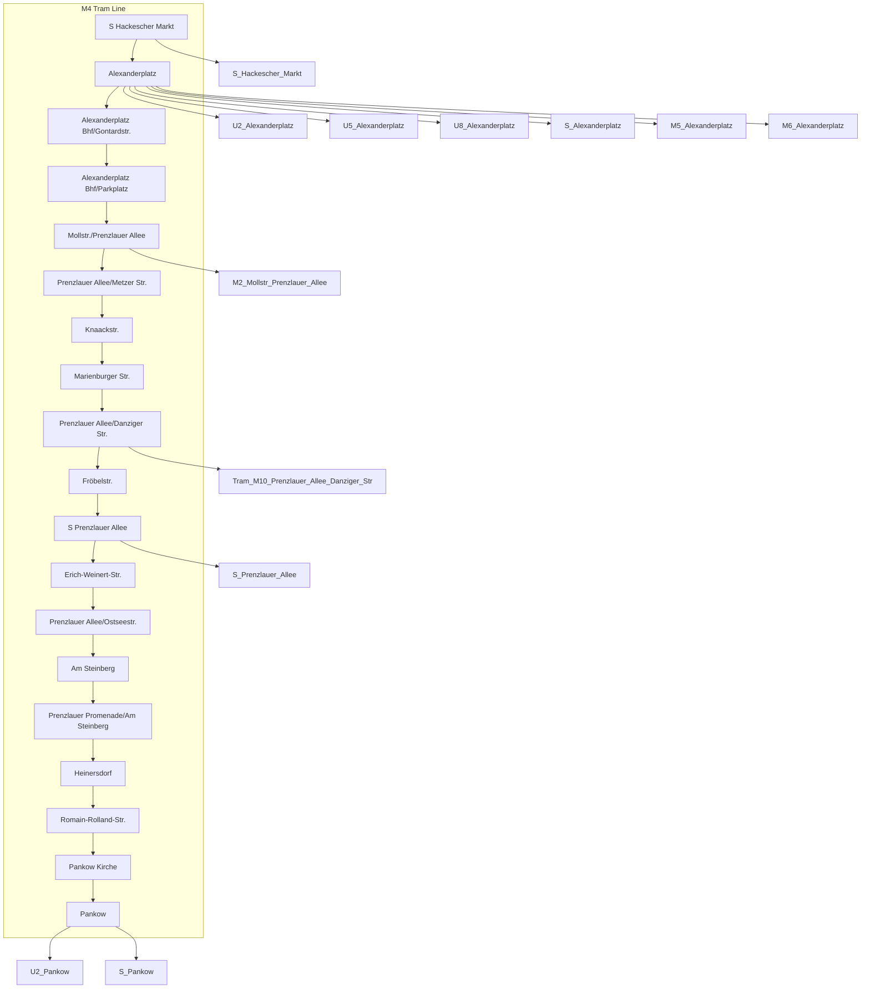

## #has_/diagram 

```mermaid
graph TD
  %% M4 Tram Line with Connections
  subgraph M4 ["M4 Tram Line"]
    M4_S_Hackescher_Markt["S Hackescher Markt"] --> M4_Alexanderplatz["Alexanderplatz"]
    M4_Alexanderplatz --> M4_Alexanderplatz_Bhf_Gontardstr["Alexanderplatz Bhf/Gontardstr."]
    M4_Alexanderplatz_Bhf_Gontardstr --> M4_Alexanderplatz_Bhf_Parkplatz["Alexanderplatz Bhf/Parkplatz"]
    M4_Alexanderplatz_Bhf_Parkplatz --> M4_Mollstr_Prenzlauer_Allee["Mollstr./Prenzlauer Allee"]
    M4_Mollstr_Prenzlauer_Allee --> M4_Prenzlauer_Allee_Metzer_Str["Prenzlauer Allee/Metzer Str."]
    M4_Prenzlauer_Allee_Metzer_Str --> M4_Knaackstr["Knaackstr."]
    M4_Knaackstr --> M4_Marienburger_Str["Marienburger Str."]
    M4_Marienburger_Str --> M4_Prenzlauer_Allee_Danziger_Str["Prenzlauer Allee/Danziger Str."]
    M4_Prenzlauer_Allee_Danziger_Str --> M4_Fröbelstr["Fröbelstr."]
    M4_Fröbelstr --> M4_S_Prenzlauer_Allee["S Prenzlauer Allee"]
    M4_S_Prenzlauer_Allee --> M4_Erich_Weinert_Str["Erich-Weinert-Str."]
    M4_Erich_Weinert_Str --> M4_Prenzlauer_Allee_Ostseestr["Prenzlauer Allee/Ostseestr."]
    M4_Prenzlauer_Allee_Ostseestr --> M4_Am_Steinberg["Am Steinberg"]
    M4_Am_Steinberg --> M4_Prenzlauer_Promenade_Am_Steinberg["Prenzlauer Promenade/Am Steinberg"]
    M4_Prenzlauer_Promenade_Am_Steinberg --> M4_Heinersdorf["Heinersdorf"]
    M4_Heinersdorf --> M4_Romain_Rolland_Str["Romain-Rolland-Str."]
    M4_Romain_Rolland_Str --> M4_Pankow_Kirche["Pankow Kirche"]
    M4_Pankow_Kirche --> M4_Pankow["Pankow"]
  end

  %% Connections to Other Lines
  %% S Hackescher Markt
  M4_S_Hackescher_Markt --> S_Hackescher_Markt

  %% Alexanderplatz
  M4_Alexanderplatz --> U2_Alexanderplatz
  M4_Alexanderplatz --> U5_Alexanderplatz
  M4_Alexanderplatz --> U8_Alexanderplatz
  M4_Alexanderplatz --> S_Alexanderplatz
  M4_Alexanderplatz --> M5_Alexanderplatz
  M4_Alexanderplatz --> M6_Alexanderplatz

  M4_Mollstr_Prenzlauer_Allee --> M2_Mollstr_Prenzlauer_Allee

  M4_Prenzlauer_Allee_Danziger_Str --> Tram_M10_Prenzlauer_Allee_Danziger_Str

  M4_S_Prenzlauer_Allee --> S_Prenzlauer_Allee

  %% Pankow
  M4_Pankow --> U2_Pankow
  M4_Pankow --> S_Pankow

```

