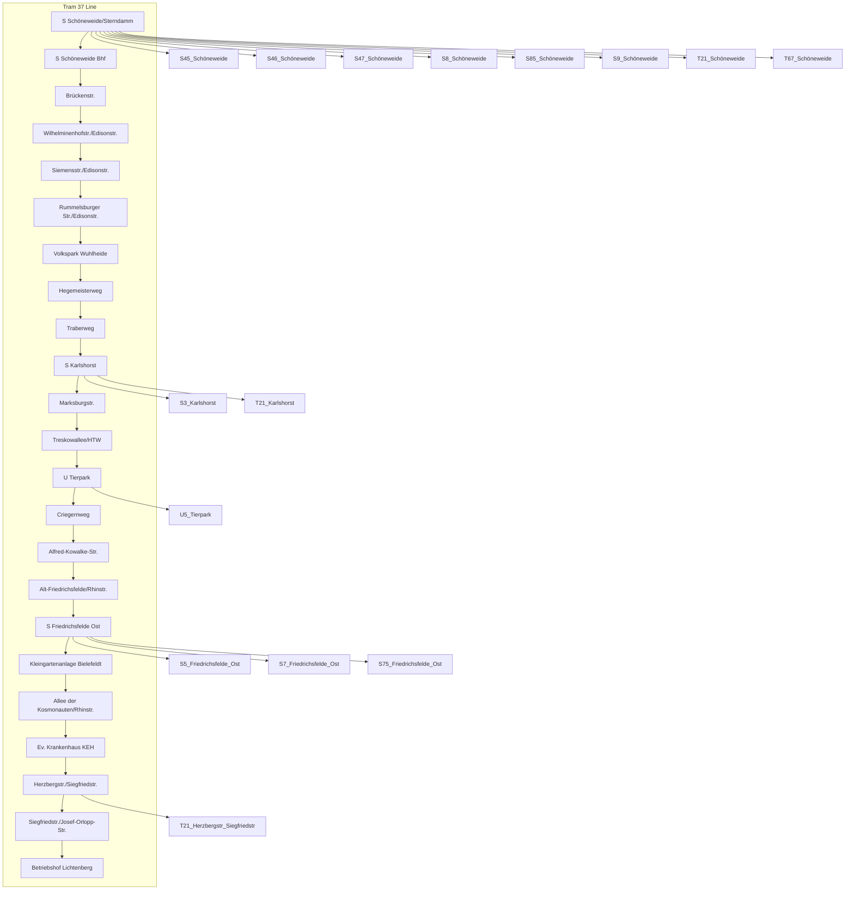

## #has_/diagram 

## Confidential Links & Embeds: 

### [T37,Berlin.public](/_public/\Earth\Continent\Europe\Europe~Central\Germany\Germany~West\State~Berlin\cities~Berlin\cities~Berlin\Berlin-city\Tram,BerlinT37,Berlin.public.md) 

### [T37,Berlin.internal](/_internal/\Earth\Continent\Europe\Europe~Central\Germany\Germany~West\State~Berlin\cities~Berlin\cities~Berlin\Berlin-city\Tram,BerlinT37,Berlin.internal.md) 

### [T37,Berlin.protect](/_protect/\Earth\Continent\Europe\Europe~Central\Germany\Germany~West\State~Berlin\cities~Berlin\cities~Berlin\Berlin-city\Tram,BerlinT37,Berlin.protect.md) 

### [T37,Berlin.private](/_private/\Earth\Continent\Europe\Europe~Central\Germany\Germany~West\State~Berlin\cities~Berlin\cities~Berlin\Berlin-city\Tram,BerlinT37,Berlin.private.md) 

### [T37,Berlin.personal](/_personal/\Earth\Continent\Europe\Europe~Central\Germany\Germany~West\State~Berlin\cities~Berlin\cities~Berlin\Berlin-city\Tram,BerlinT37,Berlin.personal.md) 

### [T37,Berlin.secret](/_secret/\Earth\Continent\Europe\Europe~Central\Germany\Germany~West\State~Berlin\cities~Berlin\cities~Berlin\Berlin-city\Tram,BerlinT37,Berlin.secret.md)

