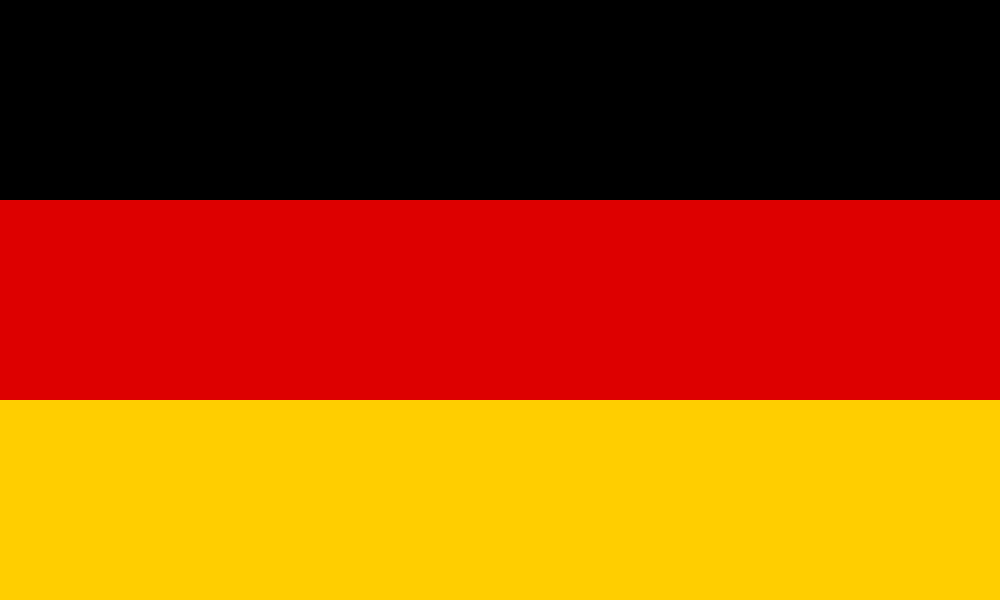
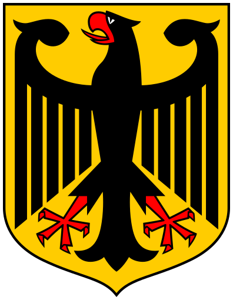

# Germany (Deutschland)
#is_a_/Place 
#is_a_ :: [[Place]] 

## International Names
[	name	 :: Germany ] 
[	name-en	 :: Germany ] 
[	name-es	 :: Alemania ] 
[	name-fr	 :: Allemagne ] 
[	name-cn	 :: 德国 ] 
[	name-ar	 :: ألمانيا ] 
[	name-ru	 :: Германия ] 
[	name-de  :: Deutschland] 

[ISO2::DE] 
[ISO3::DEU] 

This Repository/Folder/Wiki/Vault contains freely usable Text and Data 
covering the European country of [Germany](https://en.wikipedia.org/wiki/Germany). 

This Repository is intended to be shared as a common basis, 
by including it as a Sub-Repository in local File-Systems, 
specifically as part of the [\_Standards](https://github.com/SpocWiki/_Standards) Repository. 

#has_/url_for_/code_repository :: https://github.com/SpocWiki/Europe-Germany 

Check out this Repository into this Subfolder: 
\_Standards/Earth/Continent/Europe/Europe~Central/Germany 

> Caution: this is a very deep folder Structure with up to 170 Characters! 
> Make sure to check it out into a shallow Location on Windows! 
> 
> If you see an opportunity to reduce this Depth, create an Issue and discuss first, 
> because Changes may break Links or at least require every User 
> to update their local Repos! 
> 
> Constraints to consider when refactoring: 
> - Every Folder Name should be unique, also the grouping-Folders, so you can link to it without specifying the relative Path 
> - all Link-Paths should be relative. Wiki-Links are possible, but only when the Target-Folders or Files have unique Names. 
> - Between each Level and its Sub-Levels there should be a grouping Folder, to allow adding other Lists. 
>   - e.g. a City's boroughs should NOT be directly in the City Folder, but in a Sub-Folder named `City~boroughs` 

### #has_/image_for_/flag 

#has_/image_for_/flag :: ![[./Flag_of_Germany.svg|200]]  

## #has_/text_of_/abstract 

> **Germany**, officially the Federal Republic of Germany, 
> is a country in the western region of Central Europe. 
>
> It is the second-most populous country in Europe after Russia, 
> and the most populous member state of the European Union. 
>
> Germany lies between the Baltic and North Sea to the north and the Alps to the south. 
>
> Its 16 constituent states have a total population of over 84 million, 
> covering a combined area of 357,600 km2 (138,100 sq mi) 
> and sharing land borders with [[Denmark]] to the north, 
> [[Poland]] and the Czech Republic to the east, 
> [[Austria]] and [[Switzerland]] to the south, and [[France]], [[Luxembourg]], [[Belgium]], 
> and the [[Netherlands]] to the west. 
> 
> The nation's capital and most populous city is [[Berlin]] 
> and its main financial centre is [[Frankfurt]]; the largest urban area is the Ruhr.
>
> Settlement in what is now Germany began in the Lower Paleolithic, 
> with various tribes inhabiting it from the Neolithic onward, chiefly the Celts. 
> 
> Various Germanic tribes have inhabited the northern parts of modern Germany 
> since classical antiquity. A region named Germania was documented before AD 100. 
> 
> In 962, the Kingdom of Germany formed the bulk of the Holy Roman Empire. 
> 
> During the 16th century, 
> northern German regions became the centre of the Protestant Reformation. 
> Following the Napoleonic Wars and the dissolution of the Holy Roman Empire in 1806, 
> the German Confederation was formed in 1815.
>
> Formal unification of Germany into the modern nation-state commenced 
> on 18 August 1866 with the North German Confederation Treaty 
> establishing the Prussia-led North German Confederation 
> later transformed in 1871 into the German Empire. 
> 
> After World War I and the German Revolution of 1918–1919, 
> the Empire was in turn transformed into the semi-presidential Weimar Republic. 
> 
> The Nazi seizure of power in 1933 led to the establishment of a totalitarian dictatorship, 
> World War II, and the Holocaust. 
> 
> After the end of World War II in Europe and a period of Allied occupation, in 1949, 
> Germany as a whole was organized into two separate polities with limited sovereignty: 
> the Federal Republic of Germany, generally known as West Germany, 
> and the German Democratic Republic, known as East Germany, 
> while Berlin continued its de jure Four Power status. 
> 
> The Federal Republic of Germany was 
> a founding member of the European Economic Community and the European Union, 
> while the German Democratic Republic was a communist Eastern Bloc state 
> and member of the Warsaw Pact. 
> 
> After the fall of the communist led-government in East Germany, 
> German reunification saw the former East German states 
> join the Federal Republic of Germany on 3 October 1990.
>
> Germany has been described as a great power with a strong economy; 
> it has the largest economy in Europe. 
> 
> As a global power in industrial, scientific and technological sectors, 
> it is both the world's third-largest exporter and importer. 
> 
> As a developed country it offers social security, a universal health care system, 
> and tuition-free university education. 
> 
> Germany is a member of the United Nations, European Union, NATO, 
> Council of Europe, G7, G20, and OECD. 
> 
> It has the third-greatest number of UNESCO World Heritage Sites.
>
> [Wikipedia](https://en.wikipedia.org/wiki/Germany)


## Maps and Flags 


### #has_/image_for_/coat_of_arms 

#has_/image_for_/coat_of_arms :: ![[./Coat_of_arms_of_Germany.svg|150]]  

#has_/sound_of_/anthem :: ![[Anthem-Germany.mp3]]

### #has_/map 

```leaflet
id: Germany
zoomFeatures: true 
minZoom: 2 
maxZoom: 18
geojsonFolder: .//
markerFolder: ./
```

## Metadata 

[	ISO4217-currency_alphabetic	 :: EUR ] 
[	ISO4217-currency_name	 :: Euro ] 
[	ISO4217-currency_numeric	 :: 978 ] 
[	ISO4217-currency_minor_unit	 :: 2 ] 
[	ISO4217-currency_country_name	 :: GERMANY ] 

[	Telephone	 :: 49 ] 

[	Global	 :: True ] 
[	Global_Name	 :: World ] 

[	CLDR_display_name	 :: Germany ] 

[	UNTERM_English	 :: Germany ] 
[	UNTERM_English_Formal	 :: the Federal Republic of Germany ] 
[	UNTERM_Spanish_Formal	 :: la República Federal de Alemania ] 
[	UNTERM_Spanish	 :: Alemania ] 
[	UNTERM_French	 :: Allemagne (l') [fém.] ] 
[	UNTERM_Arabic	 :: ألمانيا ] 
[	UNTERM_Arabic_Formal	 :: جمهورية ألمانيا الاتحادية ] 
[	UNTERM_Chinese	 :: 德国 ] 
[	UNTERM_Chinese_Formal	 :: 德意志联邦共和国 ] 
[	UNTERM_French_Formal	 :: la République fédérale d'Allemagne ] 
[	UNTERM_Russian	 :: Германия ] 
[	UNTERM_Russian_Formal	 :: Федеративная Республика Германия ] 

Region_Name ::  [[Europe]] 
Intermediate_Region_Name ::  [[]] 
Sub-region_Name ::  [[Western Europe]] 

[	Region	 :: 150 ] 
[	Intermediate_Region	 ::  ] 
[	Sub-region	 :: 155 ] 

[	Geoname-ID	 :: 2921044 ] 
[	FIPS	 :: GM ] 
[	FIFA	 :: GER ] 
[	IOC	 :: GER ] 
[	MARC	 :: gw ] 
[	GAUL	 :: 93 ] 
[	WMO	 :: DL ] 
[	ITU	 :: D ] 
[	DS	 :: D ] 
[	TLD	 :: .de ] 
[	EDGAR	 :: 2M ] 
[	M49	 :: 276 ] 

[	is_independent	 :: Yes ] 
[	Developed_/Developing_Countries	 :: Developed ] 
[	Land_Locked_Developing_Countries	 ::  ] 
[	Least_Developed_Countries	 ::  ] 
[	Small_Island_Developing_States	 ::  ] 

[	ISO3166-1-numeric	 :: 276 ] 

[Area-Total::357042] 
[Area-Land::349270] 
has_place_continent:: [[Europe]]  
[VehicleCode::D] 
Capital :: [[Berlin]]  
[Alcohol-l::12.8] 
[Language-Id::497] 
#is_a_/Place  
#is_a_ :: [[Place]] 
[has_place_longitude::10.1207] 
[has_place_latitude::50.8699] 


## Confidential Links & Embeds: 

### [ReadMe](/_Standards/Earth/Continent/Europe/Europe~Central/Germany/ReadMe.md) 

### [ReadMe.public](/_public/Earth/Continent/Europe/Europe~Central/Germany/ReadMe.public.md) 

### [ReadMe.internal](/_internal/Earth/Continent/Europe/Europe~Central/Germany/ReadMe.internal.md) 

### [ReadMe.protect](/_protect/Earth/Continent/Europe/Europe~Central/Germany/ReadMe.protect.md) 

### [ReadMe.private](/_private/Earth/Continent/Europe/Europe~Central/Germany/ReadMe.private.md) 

### [ReadMe.personal](/_personal/Earth/Continent/Europe/Europe~Central/Germany/ReadMe.personal.md) 

### [ReadMe.secret](/_secret/Earth/Continent/Europe/Europe~Central/Germany/ReadMe.secret.md)

